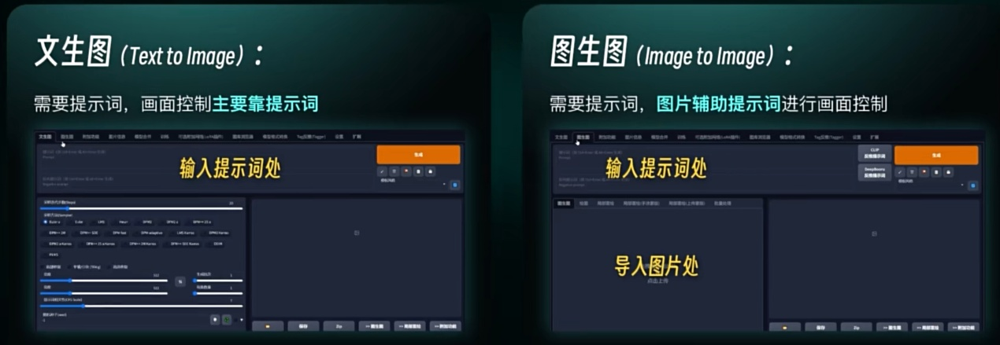

# 1. 重要意义

- 与AI科学高效沟通的**桥梁**


# 2. 使用场景

## 2.1 WebUI



## 2.2 ComfyUI


# 3. 包含内容

​		为获得一张表现效果较好的图像，需要以**丰富多样**的方式**描述画面内容**，主要包括：

- **作品画风**：写实风、水墨风、像素风、厚涂、彩绘……

- **人物特点**：形象、表情、动作、性别、数量……

- **服饰特点**：衣、裤、裙、帽、袜、鞋……

- **场景内容**：室内、室外、校园、草原、海洋、沙漠……

- **环境光照**：白天、傍晚、深夜、清晨、黄昏……

- **视角设定**：拍摄距离、人物比例、观察视角……

  所有内容都可以**自由组合、加减权重**，以达到期待的图像生成效果。


# 4. 语法规则

1. 提示词**必须**以**英文**书写

2. 提示词目前分为**词组型**和**语句型**两个方案，**可以混用**

3. **词组型**方案

   - 提示词以**词组**作为单位，不需要拥有完整且正确的语法结构
- **词组与词组之间**以**英文半角逗号**为分隔符
   - **示例**
     - ❌ ~~苹果，橘子，梨~~
     - ✔️ **apple, orange, pear**
     - ❌ ~~Please draw a picture with a girl walking at the beach.~~
     - ✔️ **a girl, walking, beach**
4. **语句型**方案

   - 提示词主要以**语句**作为单位，也可穿插**词组**
   - **语句与语句之间**以**英文半角句号**为分隔符——更类似于**自然语言**的表达方式
   - **示例**

   ```text
   The image is a 3D digital art picture. It is in picos style. It describes a young Asian woman sitting on a wooden chair. She is wearing a white collared shirt with a blue and white striped tie and a black skirt. Her long black hair is styled in loose waves and she is looking directly at the camera with a slight smile on her face.
   ```

# 5. 正向提示词

## 5.1 特点

- 描述**画面内容**，希望画面里**要**出现什么

## 5.2 内容型提示词

- **主体特征**
  - **角色类型**：1 girl,1 boy, maid, loli, waitress, doctor,nurse, dancer……
  - **特定人物**：megurine luka, hatsune miku, hakurei reimu……
  - **服饰穿搭**：white dress, blue skirt, jewelry, blue gemstone, crown, white veil, neck ring……
  - **发型发色**：long hair, short hair, white hair, curly hair, bangs, twin braids……
  - **五官特点**：small eyes, yellow eyes, one eye closed, big mouth, bunny ears, fox ears……
  - **面部表情**：smile, blush, smirk, surprised, tearing up, serious, nervous……
  - **身材特征**：muscle, thin, slim, breasts, cleavage, tail……
  - **肢体动作**：stretching_arms, holding_hands, crossed_legs, back-to-back, hand in own hair……
- **场景特征**
  - **室内、室外**：indoor, outdoor……
  - **场景**：forest, city, street, house, caffe house, classroom, shop, on the beach……
  - **细节**：trees, bush, flowers, petals, plant, firefly, feather, wooden_ladder……

- **环境光照**
  - **白天黑夜**：day, night……
  - **特定时段**：morning, sunset, bright, dark……
  - **自然环境**：sunlight, light rays, blue sky, starry sky, rainy, cloudy,  full_moon, shooting star……

- **画幅视角**
  - **距离**：close-up, distant, symmetrical, self_mirror……
  - **人物形体**：full body, bust, upper body, lower body, from behind, back, turning around……
  - **观察视角**：from above, view of back, looking up,looking down, looking afar,looking away……

## 5.3 标准化提示词

- **画质**
  - **通用高画质**：best quality, finely detail, masterpiece, wallpaper, checkered……
  - **特定高分辨率类型**：Ultra HD, highres, CG Digital rendering, 4K, extremely detailed wallpaper……

- **画风**
  - **插画风**：illustrtion, water colour painting, Ukiyoe, pixel art, anime, cartoon, comic……
  - **艺术作品**：coil painting, Baroque, folk art, ink painting, pop art, impressionism……
  - **写实系**：photorealistic, realistic, photograph……

# 6. 反向提示词

## 6.1 特点

- 描述**画面内容**，希望画面里**不要**出现什么
- 可以**没有**
- 可以使用通用的**标准化提示词**

## 6.2 标准化提示词

- **画质**：worst quality, low quality, low resolution, normal quality, gray scale……
- **主体特征**：ugly, blurry, duplicate, bad anatomy, bad proportions, missing arms, missing hands, extra fingers, extra legs, bad hands, missing fingers, unclear eyes……

# 7. 权重设定

## 7.1 初阶用法

- **括号和数字**：**增强或减弱**某些提示词的优先级，建议调整范围：**1 ± 0.05**
- **圆括号**：**每套一层括号，权重调整为1.1倍**（增强）
  - `((white_flower))`——白花权重调整为1.21倍
- **方括号**：**每套一层括号，权重调整为0.9倍**（减弱）
  - `[[white_flower]]`——白花权重调整为0.81倍
- **花括号**：**每套一层括号，权重调整1.05倍**（增强）
  - `{{white_flower}}`——白花权重调整为1.1025倍
- **圆括号+数字**：**括号表示优先级调整，数字表示权重**
  - `(white_flower:1.5)`——白花权重调整为1.5倍
  - `(yellow_leaf:0.85)`——黄树叶权重调整 为0.85倍

## 7.2 高阶用法

- **混合**：**混合两个描述同一对象的提示词**
  - `white | yellow flower`——**生成黄色和白色混合的花**
- **迁移**：**连续生成具有不同特征的对象，不断迁移**
  - `[white|red|blue] flower`——**先生成白花，再生成红花，再生成蓝花**
- **迭代**：与采样进程关联，**一定阶段以后再生成特定对象**
  - `(white_flower:bush:0.8)`——**进程达到80%之前生成白花，达到80%之后生成灌木**

## 7.3 注意

​		虽然**WebUI**和**ComfyUI**都使用同一套权重书写逻辑，但是**ComfyUI**的权重调整步长单位是**0.05**，**WebUI**的权重调整步长单位是**0.1**——如果将**WebUI**的提示词**原封不动**地复制至**ComfyUI**中，会出现**提示词权重过大**的问题。

# 8. 经验分享

- 提示词**不是一下子就写好的**，而是**先有一个雏形**，再**慢慢细化、补充和微调**的。
- 可以**先用母语描述想绘画的内容**，再**翻译成英文**，誊写时可以使用建议的提示词。
- 通过**提示词平台**的协助，可以更方便地确定提示词。
- **借鉴其他作者的提示词，按照自己的喜好进行复用或改写**。参考平台：[AIGodLike](https://www.aigodlike.com/)、[civitai](https://civitai.com)、[OpenArt](https://openart.ai)
- **语法规则**将跟随AI技术的提升，逐步向 **`自然语言`** 、 **`多语种`** 方向发展，将来**撰写提示词工作会变得更加轻松容易**。
