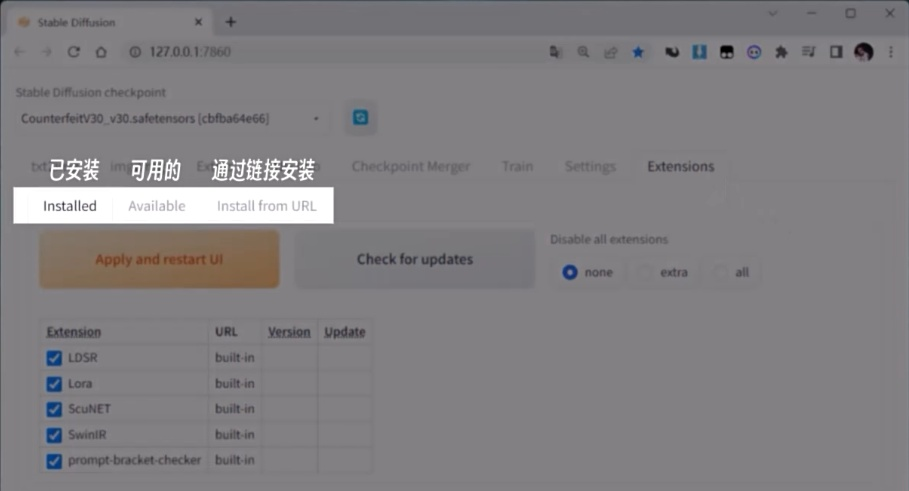
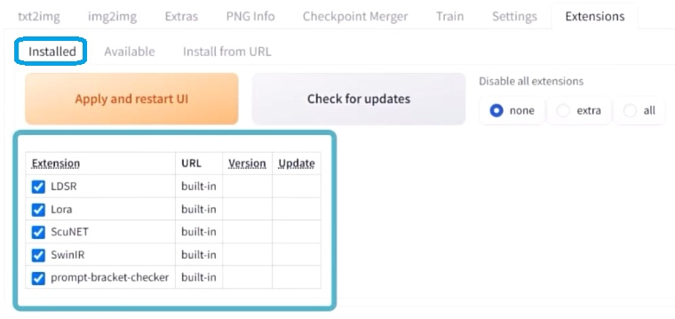
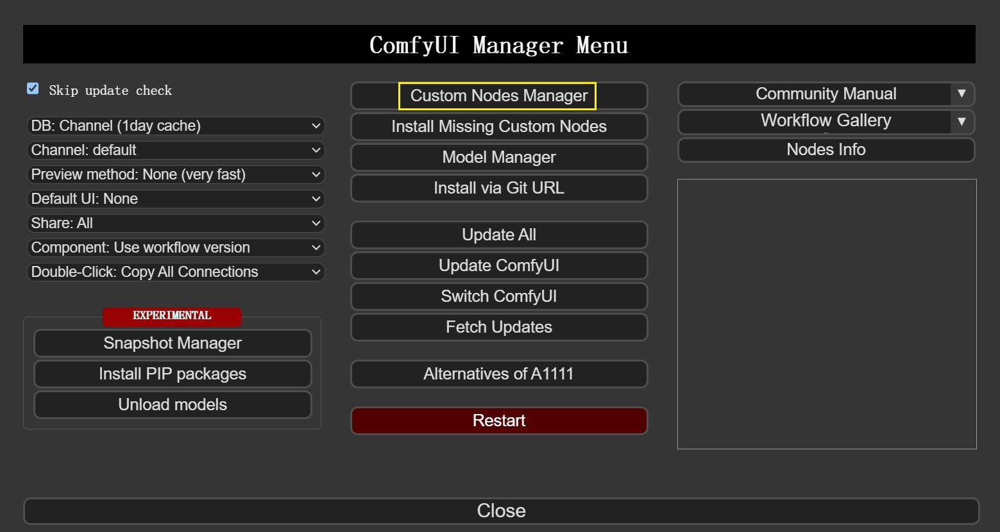
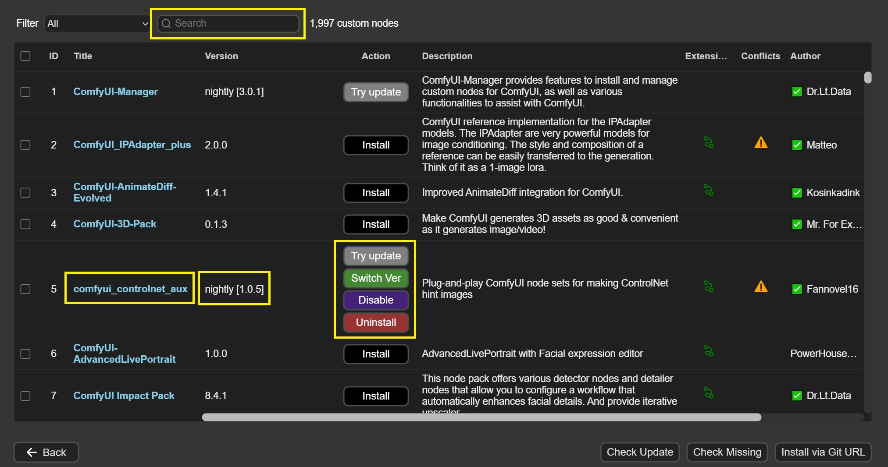

# 1. 说明

​		**插件**（extensions），亦称作**扩展**、**节点**，用来作为**扩充WebUI和ComfyUI使用功能**的组件。

# 2. WebUI插件安装

## 2.1 管理位置

- 管理插件的页面：**“扩展”标签**



- 管理插件的位置：`WebUI/extensions`，**每一个扩展插件是一个单独的文件夹**

## 2.2 安装方式一：通过URL链接自动下载安装

1. 从Github代码仓库找到扩展插件，获取**仓库链接**
2. **粘贴仓库链接**，予以**安装**


## 2.3 安装方式二：手动下载包文件安装

1. **将下载好的扩展插件文件夹，放置在扩展插件文件夹内**
   - **已安装**列表下显示了当前安装的插件



2. 扩展插件安装完成后，需要点击“**Apply and restart UI**”，重启UI予以激活

# 3. WebUI插件推荐

## 3.1 界面汉化包

- 仓库地址：[**stable-diffusion-webui-localization-zh_Hans**](https://github.com/hanamizuki-ai/stable-diffusion-webui-localization-zh_Hans)

## 3.2 提示词自动补全、翻译

- 仓库地址：[**a1111-sd-webui-tagcomplete**](https://github.com/DominikDoom/a1111-sd-webui-tagcomplete)

## 3.3 提示词反推

- 仓库地址：[**stable-diffusion-webui-wd14-tagger**](https://github.com/picobyte/stable-diffusion-webui-wd14-tagger)

## 3.4 图库浏览器

- 仓库地址：[**sd-webui-images-browser**](https://github.com/Akegarasu/sd-webui-images-browser)

# 4. ComfyUI插件安装

## 4.1 管理位置

- 管理插件的位置：`ComfyUI/custom_nodes`，**每一个扩展是一个单独的文件夹**

## 4.2 安装方式一：通过ComfyUI Manager自动下载安装

1. 打开`ComfyUI Manger`，选择`Custom Nodes Manager`。

2. 在搜索框里可以`搜索插件`，在搜索结果中，可以查看**插件名称**、**插件版本**、**更新插件**、**切换插件版本**、**禁用插件**、**卸载插件**等功能。

## 4.3 安装方式二：手动下载包文件安装

1. 进入插件文件夹

```bash
cd ComfyUI/custom_nodes
```

2. 从Github代码仓库找到插件，获取**仓库链接**，**下载**并**安装**
   - **大多数插件**都需要再**安装依赖环境**，也有**少数插件下载即可使用**

```bash
# 下载插件，以ComfyUI-Manager为例
git clone https://github.com/ltdrdata/ComfyUI-Manager.git

# 安装插件的依赖环境
cd ComfyUI-Manager
pip install -r requirements.txt
```

3. **重新启动ComfyUI**，插件会自动激活

# 5. ComfyUI插件推荐

## 5.1 节点管理器

- 仓库地址：[**ComfyUI_Manager**](https://github.com/ltdrdata/ComfyUI-Manager)

## 5.2 核心功能

- 仓库地址：[**ComfyUI_essentials**](https://github.com/cubiq/ComfyUI_essentials)

## 5.3 提示词反推

- 仓库地址：[**ComfyUI-WD14-Tagger**](https://github.com/pythongosssss/ComfyUI-WD14-Tagger)
- 仓库地址：[**ComfyUI-Florence2**](https://github.com/kijai/ComfyUI-Florence2)

## 5.4 从URL获取图像

- 仓库地址：[**ComfyUI-load-image-from-url**](https://github.com/tsogzark/ComfyUI-load-image-from-url)

## 5.5 ControlNet组件

- 仓库地址：[**comfyui_controlnet_aux**](https://github.com/Fannovel16/comfyui_controlnet_aux)
