# 1. WebUI

## 1.1 载入模型

- 选取**AI模型**进行加载，如有必要，还需要加载**VAE模型**

## 1.2 填写正向提示词

- 希望在画面中**出现**的内容
- 提示词 **`只支持英文`**

## 1.3 填写反向提示词

- 希望画面中需要**排除**的内容
- 提示词 **`只支持英文`**

## 1.4 设置合适的AI参数

- **采样迭代次数**：28步左右
- **采样方法**
  - **采样器**：Euler、DPM……
  - **调度器**：Normal、Simple、Karras、sgm_uniform……
- **图像尺寸**：宽度、高度
- **提示词引导系数**
- **批量生产**：总批次数、单批生成数
- **随机数种子**

## 1.5 生成图片

- 点击**生成**按钮

## 1.6 浏览AI生成的图片

- 默认存放在本地的**outputs**文件夹中的**txt2img-images**文件夹中

## 1.7 示例

# 2. ComfyUI

## 2.1 搭建工作流

​		主要分为**载入模型**、**撰写提示词**、**设置采样器**、**设置VAE解码**、**图像预览或保存**等功能模块。

### ① SD 1.5 工作流，K采样器

### ② SDXL 工作流，K采样器

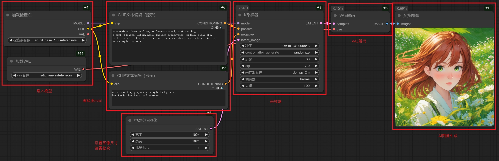

### ③ SDXL 工作流，自定义采样器

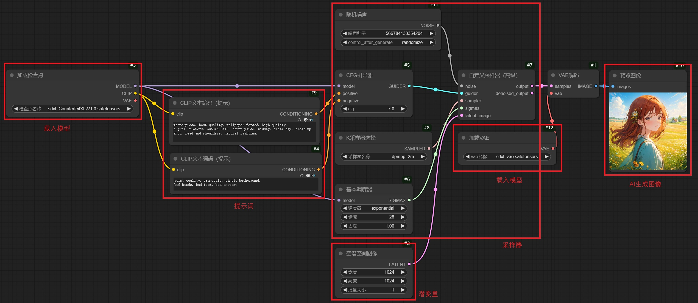

### ④ SD 3.5 工作流，K采样器

### ⑤ FLUX 工作流，K采样器

- **CFG必须为1.0**

### ⑥ FLUX 工作流，自定义采样器

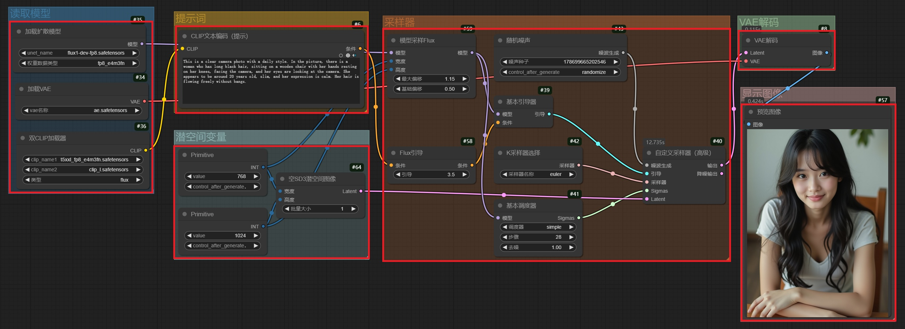

## 2.2 载入模型

- 选取**AI模型**进行加载
- 选取对应的**VAE模型**进行加载
- 选取**CLIP模型**进行加载（如有需要）

## 2.3 提示词

- **正向提示词**：连接至**采样器**的**positive输入端**
  - 希望在画面中**出现**的内容
  - 提示词 **`只支持英文 `**（依赖于模型）
- **反向提示词**：连接至**采样器**的**negative输入端**
  - 希望画面中需要**排除**的内容
  - 提示词 **`只支持英文`** （依赖于模型）

## 2.4 设置合适的AI参数

- **种子**：随机数种子
- **步骤**：采样迭代次数
- **cfg**：提示词引导系数
- **采样器**：Euler、DPM……
- **调度器**：Normal、Simple、Karras、sgm_uniform……
- **图像尺寸**：宽度、高度
- **批量生产**：批量大小

## 2.5 生成图片

- **Preview Image**：**预览图像，但不保存**
- **Save Image**：**预览图像，同时保存**

## 2.6 示例

# 3. 动漫人物、动漫场景

## 3.1 提示词

- 通常情况下可以使用 `anime style`、`cartoon`、`comic` 等**风格限定提示词**

## 3.2 动漫人物

### Anything V5

### CetusMix

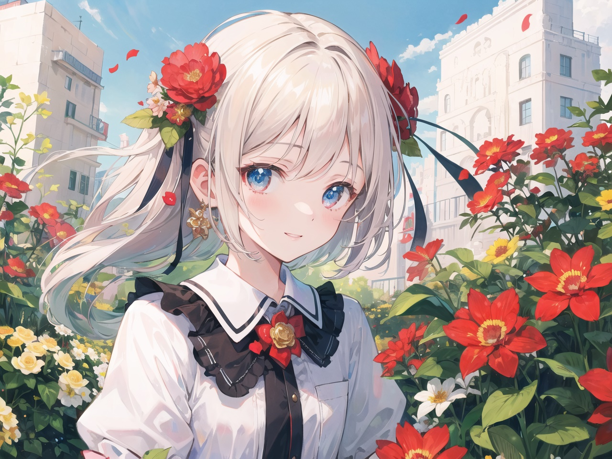

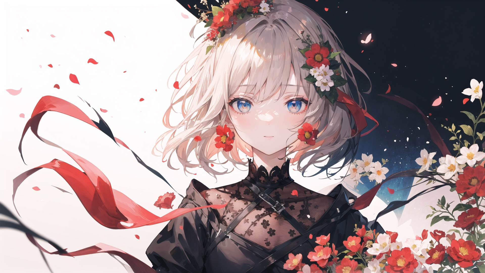

### Counterfeit

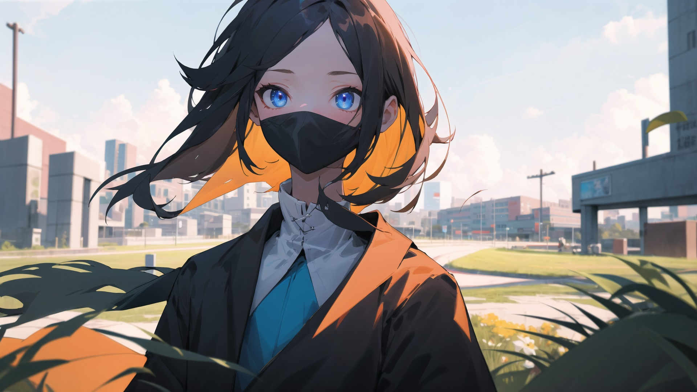

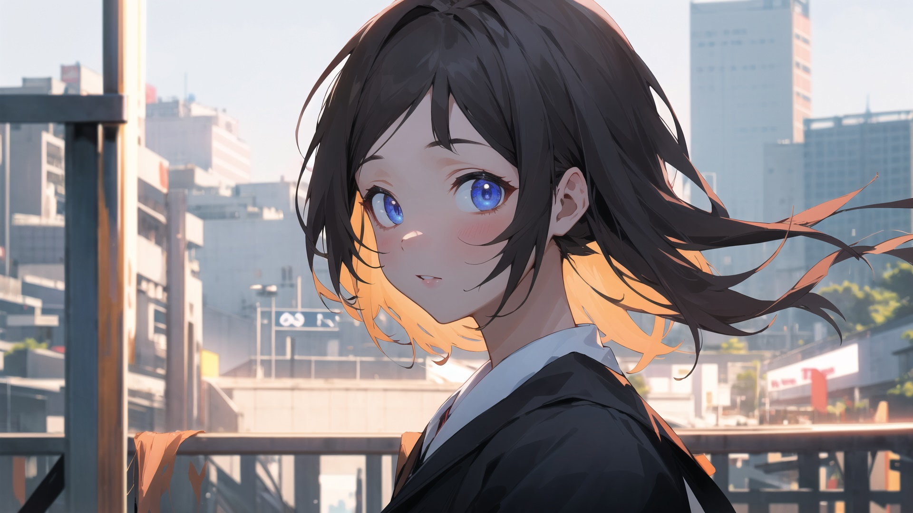

### cuteYukiMix

### DarkSushiMix

### NeverEndingDream

### ReVAnimated

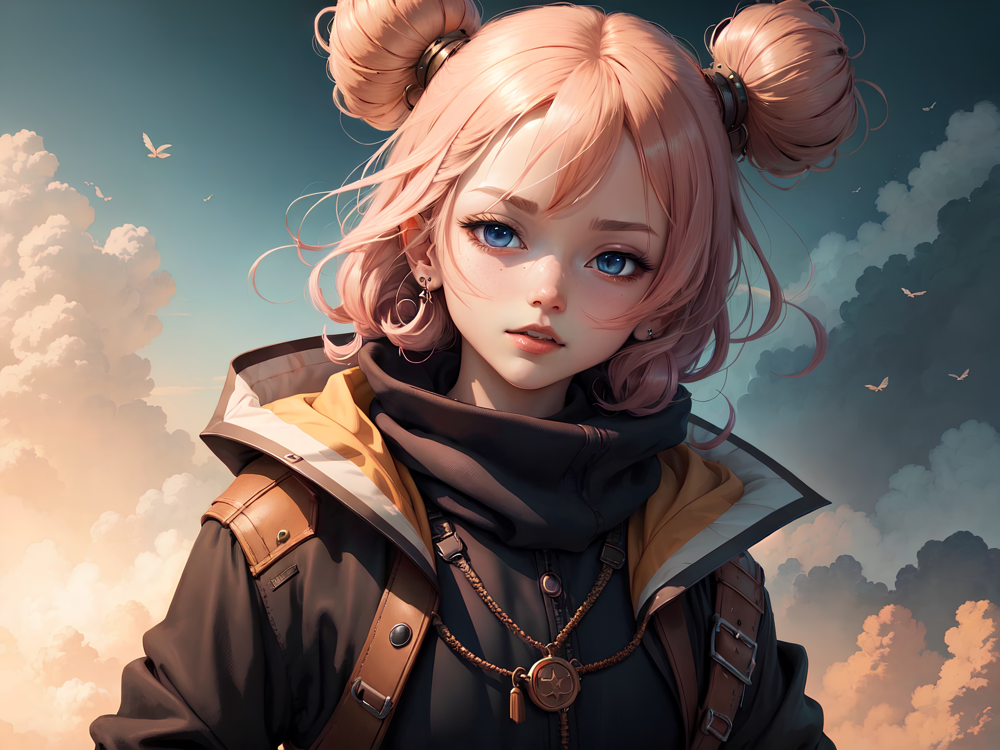

## 3.3 动漫场景

### Anything V5

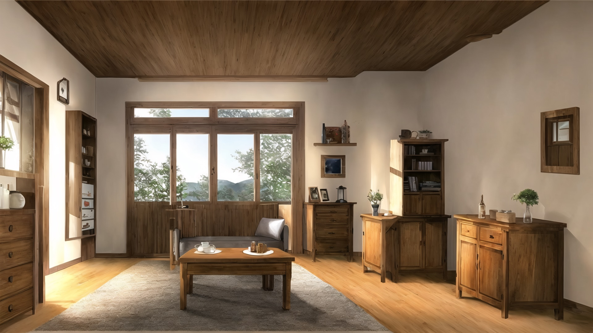

### CetusMix

### ReVAnimated

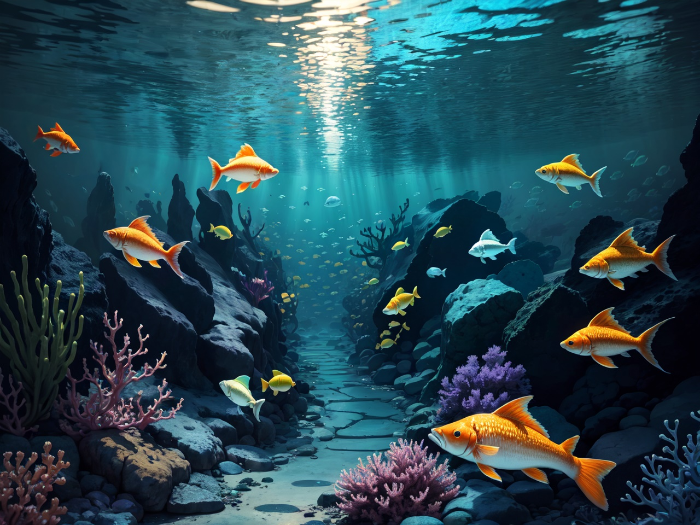

# 4. 真实人物、真实场景

## 4.1 提示词

- 通常情况下可以使用 `realistic style`、`photography` 等**风格限定提示词**

## 4.2 真实人物

### Deliberate

### RealisticVision

### DreamGirl

## 4.3 场景

### Deliberate

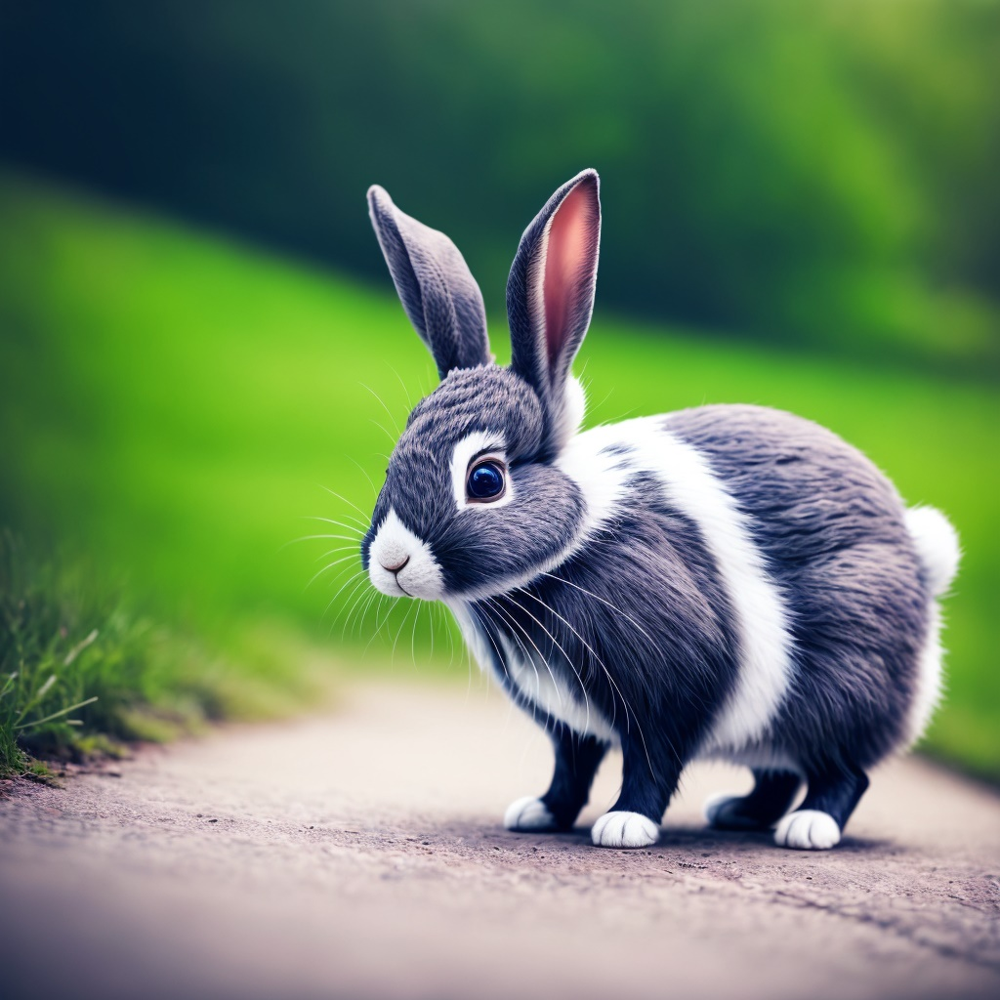

### NeverEndingDream

