# 1. 文生图

## 1.1 工作流

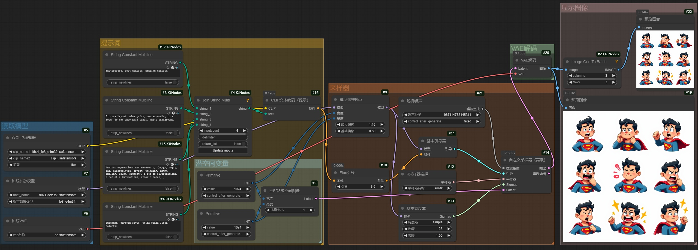

## 1.2 提示词

- `masterpiece, best quality, amazing quality,`

- `Picture layout: nine grids, corresponding to a mood, do not show grid lines, white background.`

- `Various expressions and movements, (happy, angry, sad, disappointed, crying, thinking, angry, smiling, laugh, sighing), a set of illustrations, a set of illustrations, dynamic poses,`
- `superman, cartoon style, thick black lines, colorful,`

## 1.3 效果图

|      生成图       |      生成图       |      生成图       |
| :---------------: | :---------------: | :---------------: |
|  | 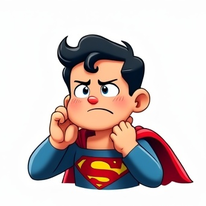 | 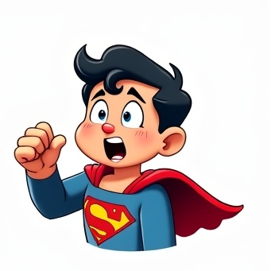 |
|  |  |  |
| 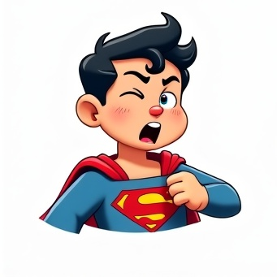 |  | 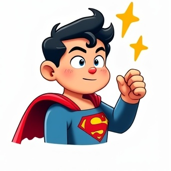 |

# 2. 文生图：角色参考

## 2.1 工作流

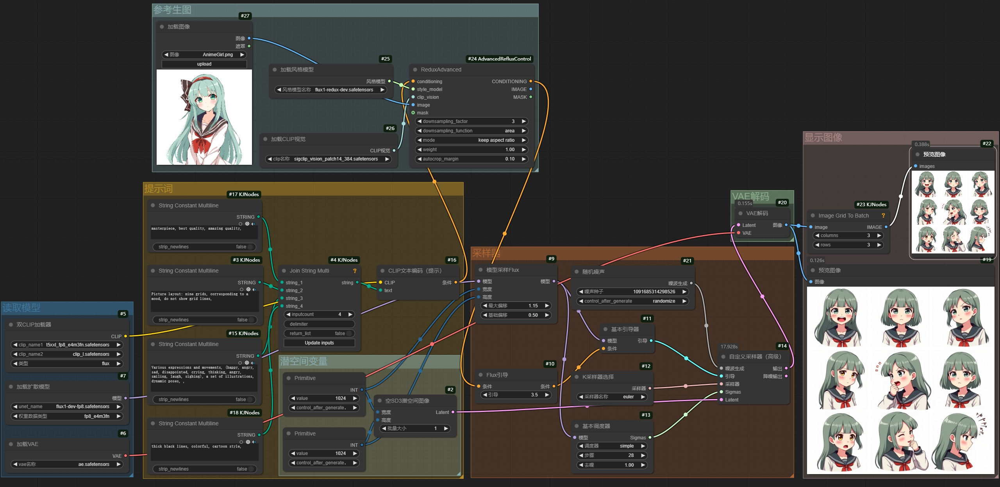

## 2.2 提示词

- `masterpiece, best quality, amazing quality,`
- `Picture layout: nine grids, corresponding to a mood, do not show grid lines`

- `Various expressions and movements, (happy, angry, sad, disappointed, crying, thinking, angry, smiling, laugh, sighing), a set of illustrations, a set of illustrations, dynamic poses, ,`
- `cartoon style, thick black lines, colorful,`

## 2.3 示例图

|          参考图          |      生成图       |
| :----------------------: | :---------------: |
|  | 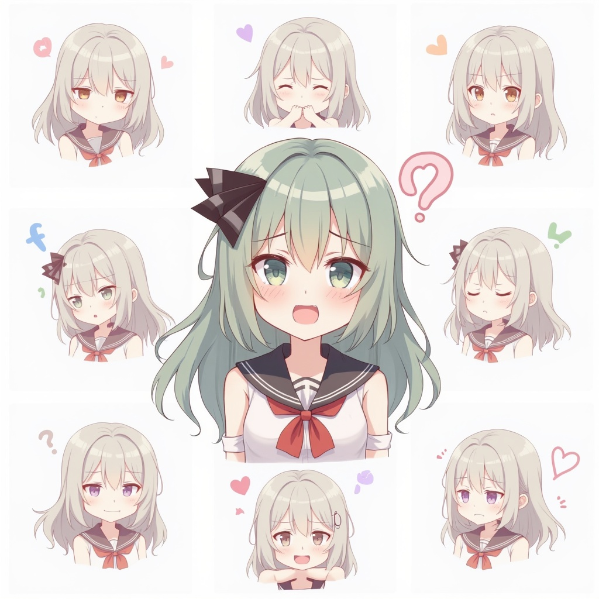 |

|      生成图       |      生成图       |      生成图       |
| :---------------: | :---------------: | :---------------: |
| 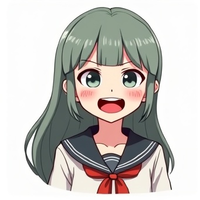 | 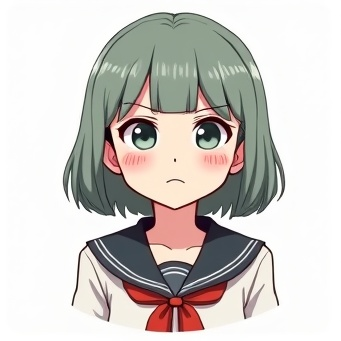 |  |
| 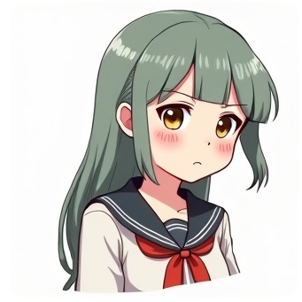 | 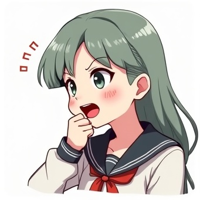 | 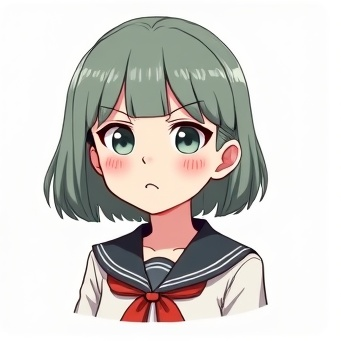 |
| 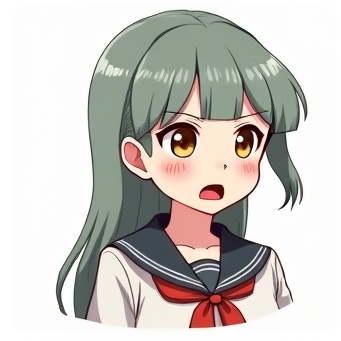 |  | 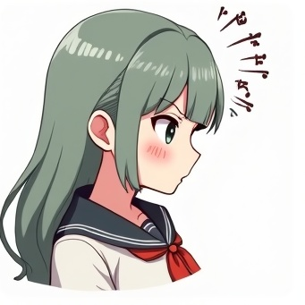 |

# 3. 文生图：角色LoRA

## 3.1 工作流

## 3.2 提示词

- `masterpiece, best quality, amazing quality,`
- `Picture layout: nine grids, corresponding to a mood, do not show grid lines`

- `Various expressions and movements, (happy, angry, sad, disappointed, crying, thinking, angry, smiling, laugh, sighing), a set of illustrations, a set of illustrations, dynamic poses, ,`
- `cartoon style, thick black lines, colorful,`

## 3.3 示例图

|      生成图       |      生成图       |      生成图       |
| :---------------: | :---------------: | :---------------: |
| 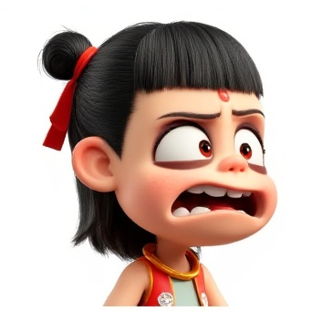 | 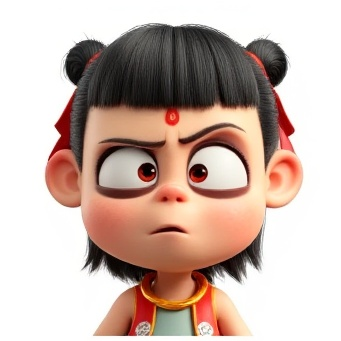 | 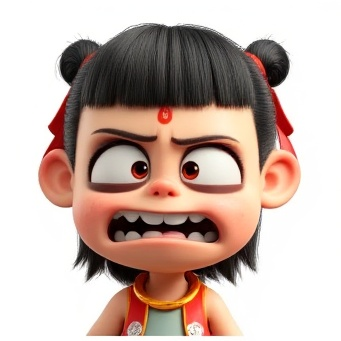 |
| 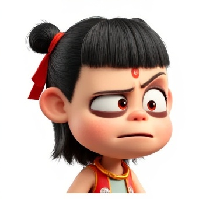 | 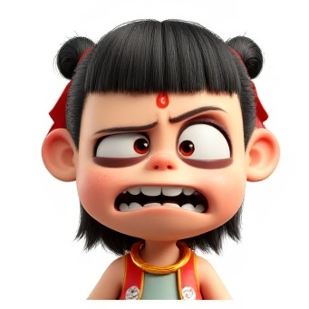 |  |
|  | 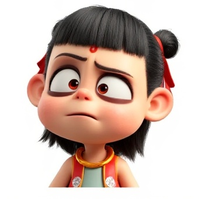 | 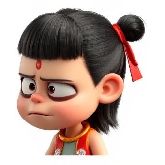 |

# 4. 使用经验

- 可能会出现**不是九宫格构图**的情况
  - **好处**：**多样的表现效果**
  - **坏处**：**不能正确切分图像**
- **通过提示词，AI并不能够准确地表现所有的表情**