# 1. 训练准备

​	训练Flux-Kontext的LoRA模型，实现风格迁移，需要准备**三样东西**：

- 一组目标风格图像（**`Target组`**）

- 一组输入控制图像（**`Control组`**）

- 一组提示词（**`Prompts`**）

  通过**将控制图和目标图配对**，**以提示词的方式**，实现**控制图到目标图的风格迁移**。

​	一般情况下，**Target组数据**比较容易获得，**提示词**也比较容易撰写，而**Control组数据**比较难获取，需要自行构建。可以使用Flux-Kontext自身的**风格迁移**功能，将**Target组**数据转换成其他风格的数据，作为**Control组**数据，如**线稿风、粘土风、写实风、像素风**等。

​	**训练数据量**控制在**20组～50组**，就可以得到不错的测试效果。

# 2. 训练工具

- **kohya-ss**：https://github.com/bmaltais/kohya_ss

- **AI-ToolKit**（简单易用，**推荐**）：https://github.com/ostris/ai-toolkit

# 3. 作业流程

## 3.1 模型训练

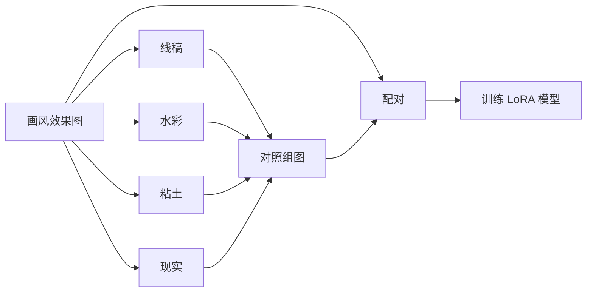

## 3.2 模型推理

# 4. 技术方案

## 4.1 直接风格迁移

​	如果LoRA模型**训练效果较好**，可以**直接将输入图转换为画风迁移的效果图**

|         画风效果         |           输入图           |           输出图            |
| :----------------------: | :------------------------: | :-------------------------: |
|  |  |  |
|  |  | 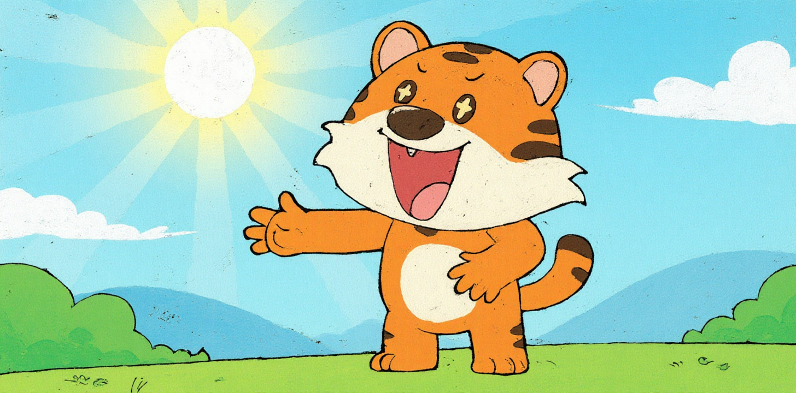 |

## 4.2 间接风格迁移

​	如果LoRA模型**训练效果一般**，可以**先将输入图转换为线稿图、水彩图等，再通过LoRA模型转换为画风迁移的效果图**

|         画风效果         |           输入图           |              中间产物              |           输出图            |
| :----------------------: | :------------------------: | :--------------------------------: | :-------------------------: |
|  |  |  |  |
|  |  |  |  |

# 5. 示例

## 5.1 训练素材

- **提示词**：`Transfer into Animal Story Style.`
- **图像**：**Control组**和**Target组**

| Control组 - I（线稿风） | Control组 - II（粘土风） |      Target组      |
| :---------------------: | :----------------------: | :----------------: |
|      |   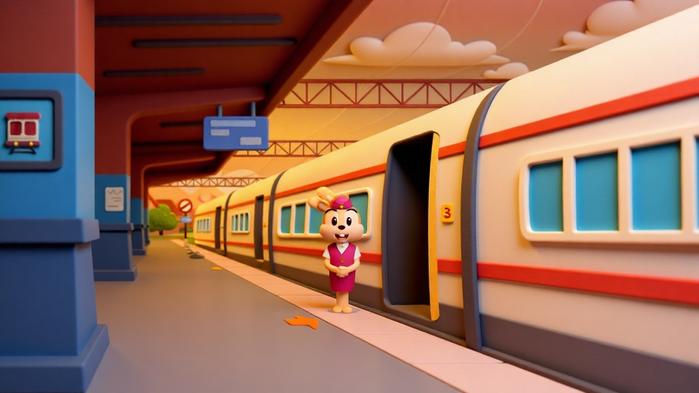    |  |
|      |   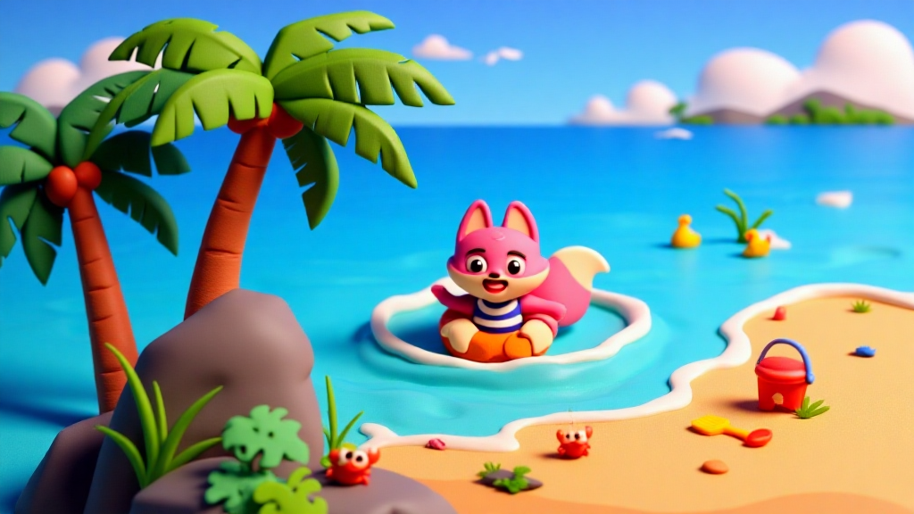    |  |
|   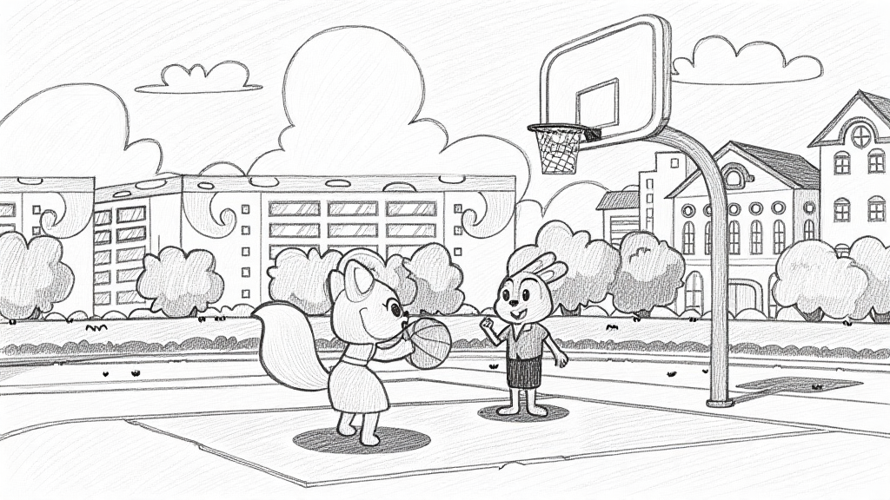   |   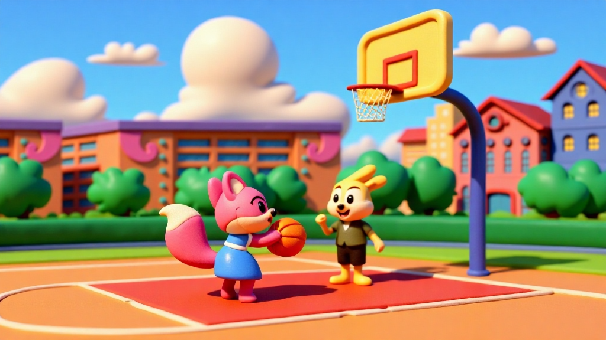    | 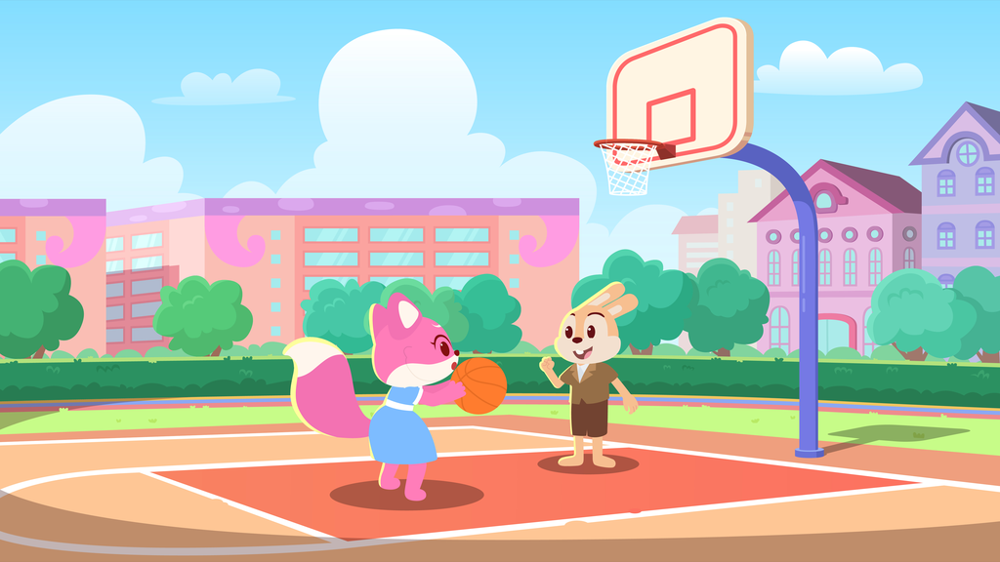 |
|      |       |  |
|   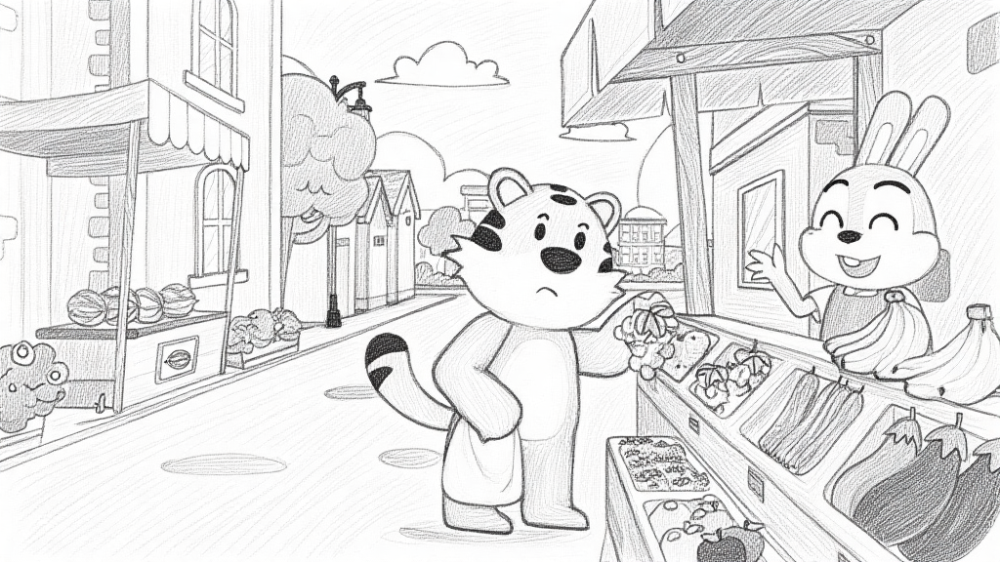   |   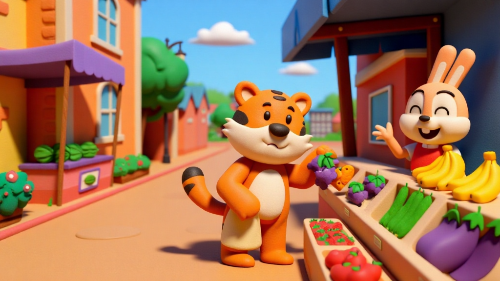    |  |
|   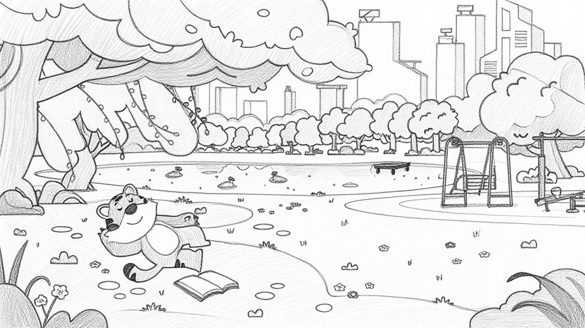   |   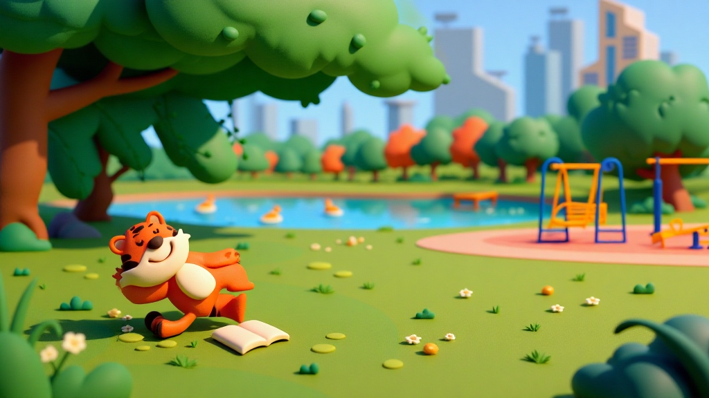    |  |

## 5.2 测试结果

|       输入1        |       输入2        |      输出1       |      输出2       |
| :----------------: | :----------------: | :--------------: | :--------------: |
| 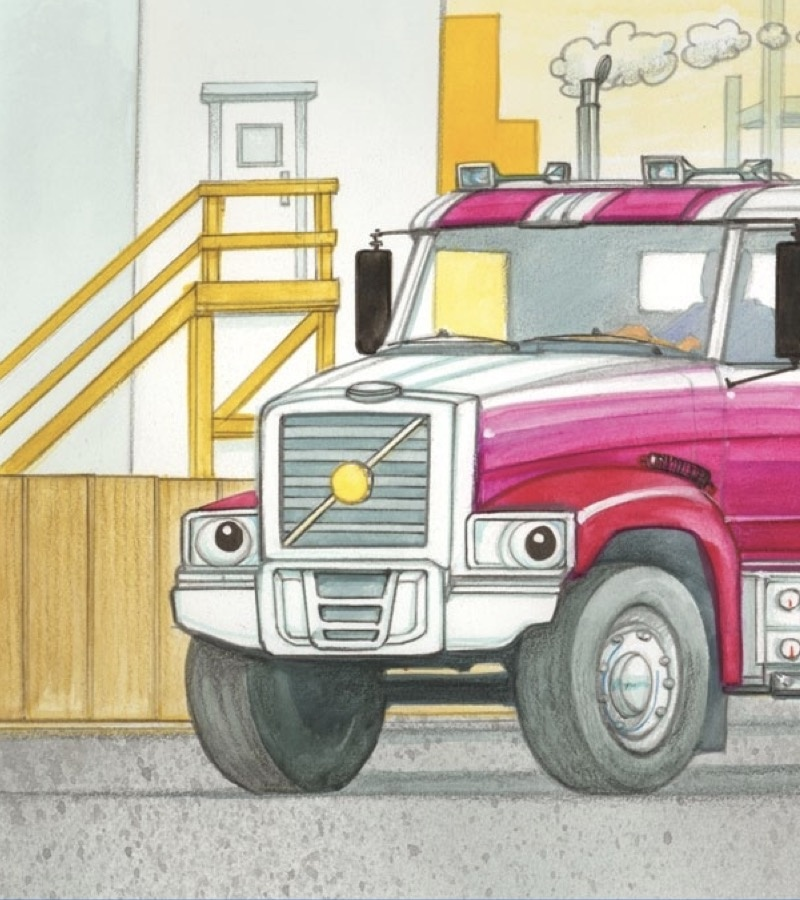 |  |  |  |
|  |  |  |  |
|  | 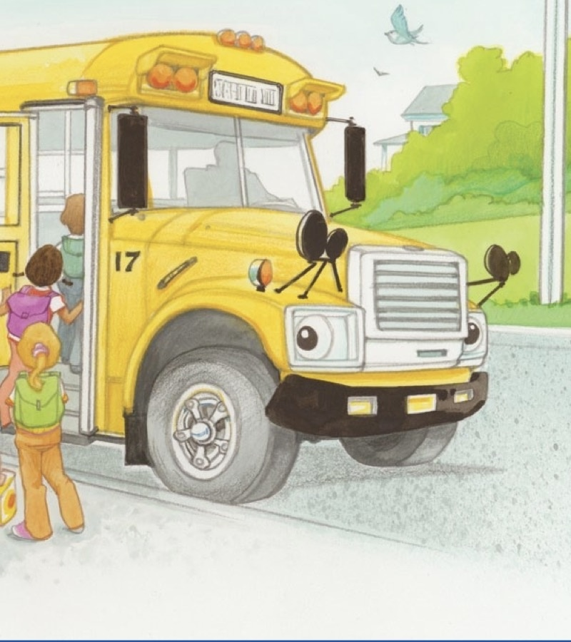 |  |  |
|  |  |  | 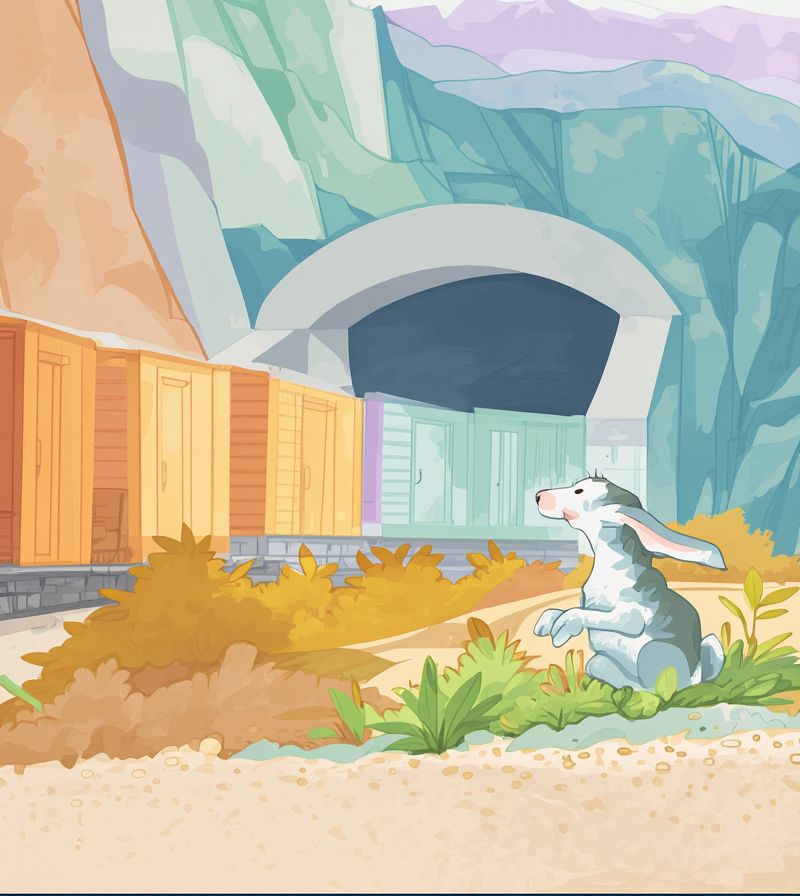 |
| 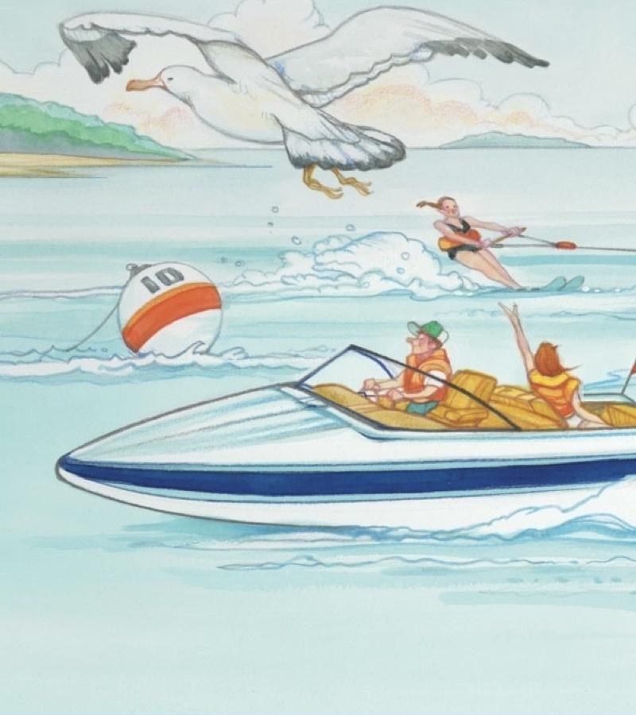 |  |  |  |
| 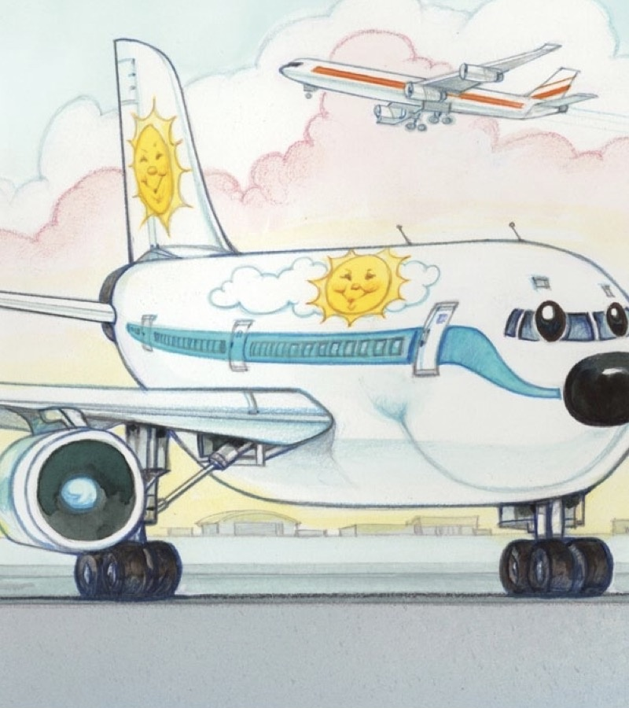 |  |  |  |
|  | 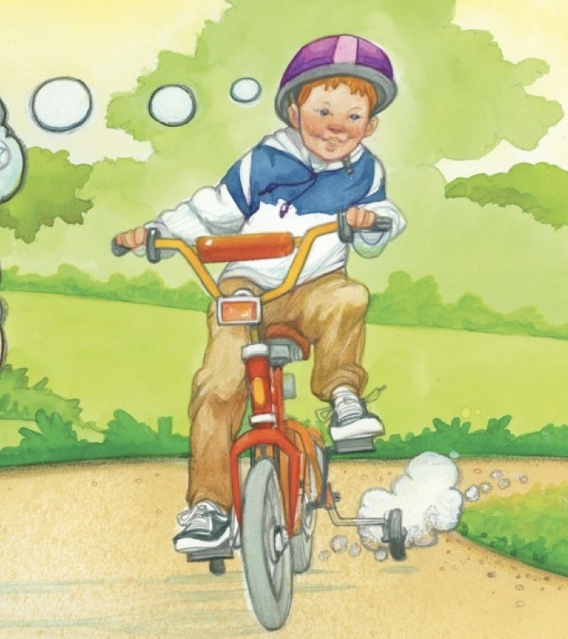 |  |  |