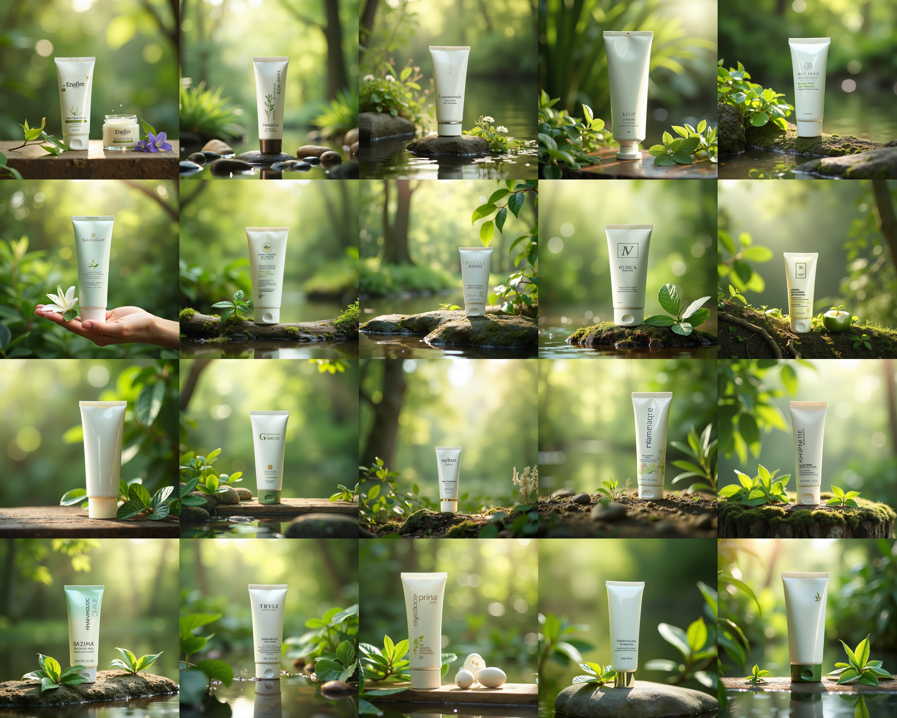
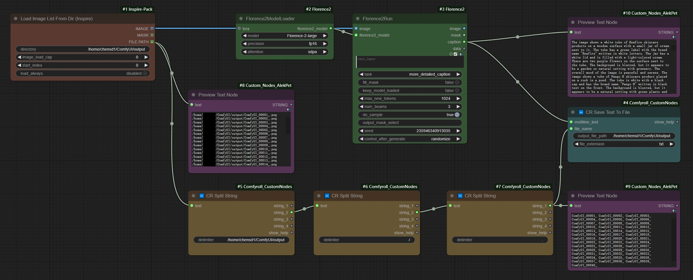
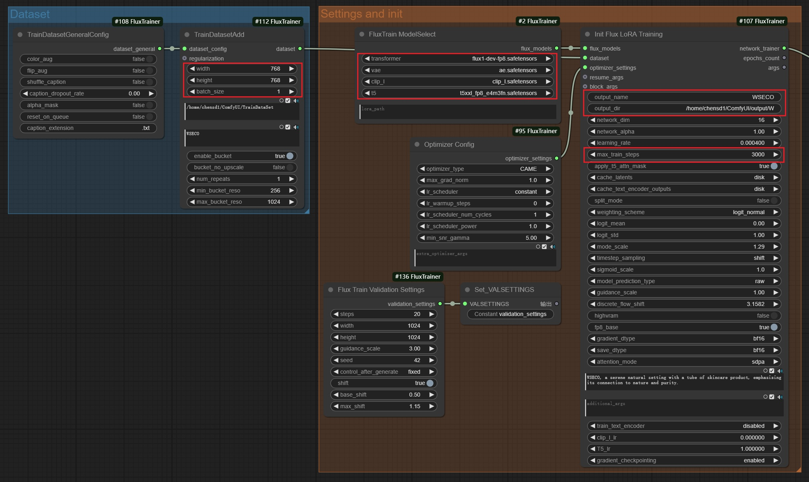
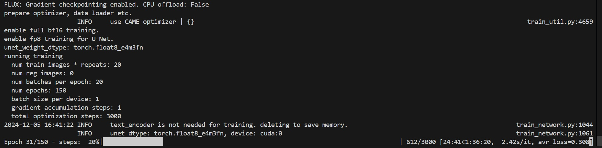
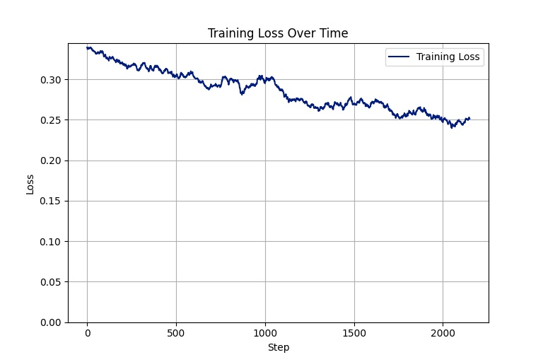
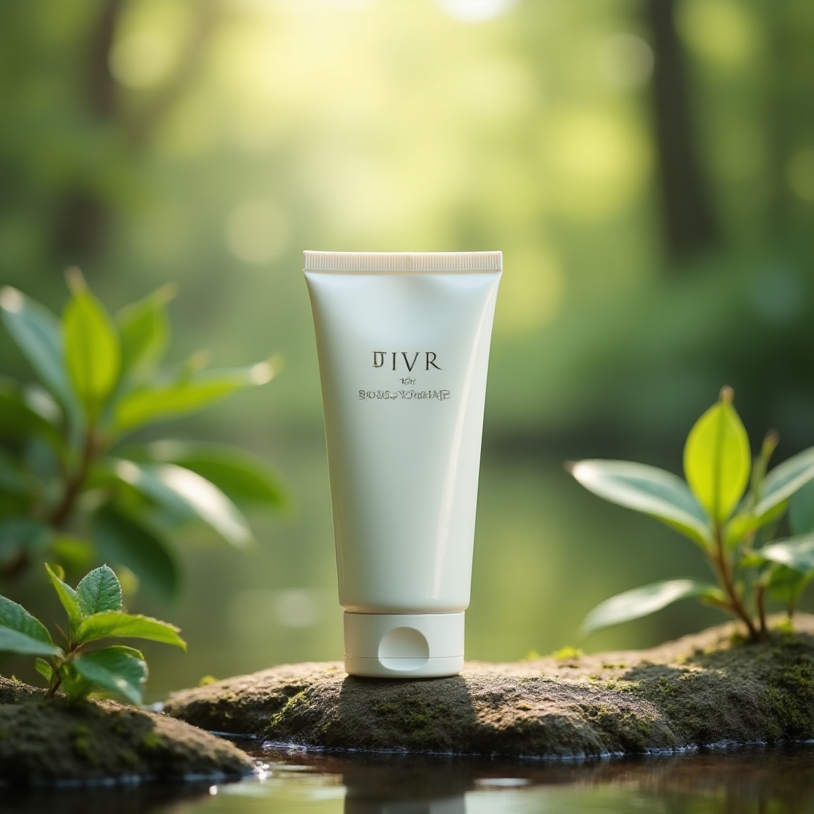
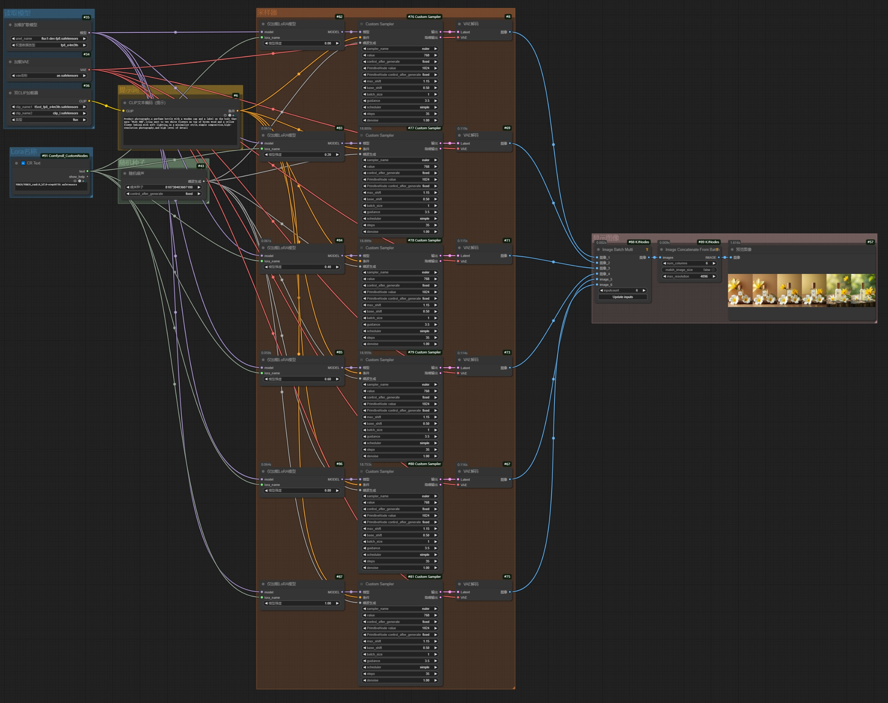
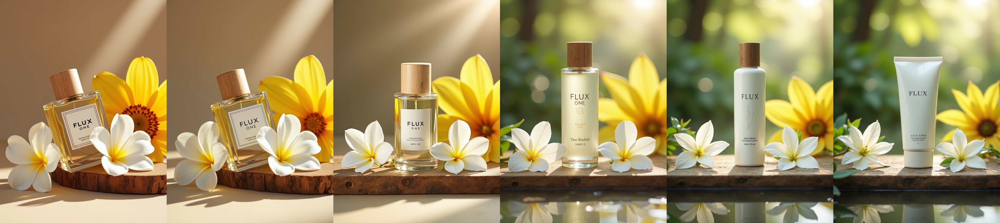

# 1. 介绍

​		LoRA是Low-Rank Adaptation的缩写，是一种**大语言模型的低秩适配器**，它可以**降低模型可训练参数，使其尽量不损失模型表现**的一种大模型微调方法。

​		训练LoRA的具体步骤主要包括：

- **`确定目的`**：训练什么类型的LoRA
- **`收集素材`**：构建训练数据集
- **`处理素材`**：裁图
- **`设置标签`**：打标
- **`清洗标签`**：更新提示词
- **`模型训练`**：训练，根据训练步数决定训练时长
- **`效果验证`**：一般采用XY表展示LoRA的训练效果

# 2. 确定目的

​		在训练LoRA模型之前，需要先**明确训练什么类型的LoRA**，主要包括：**人物角色**、**画面风格**、**概念**、**场景**、**服饰**、**特定元素**等。

​		可以简单地将其划分为两大类：**具象类**和**泛化类**，**具象类**包括**具体的物体、人物、姿势、服装、特定元素**等，**泛化类**包括**场景、艺术风格、色彩风格**等。

# 3. 收集素材

## 3.1 具象类

- **数量**：建议**30张左右**
- **素材要求**：**不同角度、不同背景、不同姿势、不同服饰，清晰无遮挡**的图片

## 3.2 泛化类

- **数量**：建议**50张以上**
- **素材要求**：**不需要特别在意同质化**，但也要注意**不要让非常接近的素材占比过高**

## 3.3 通用要求

- 尽量收集**清晰无遮挡**的图片
- 尽量收集**画质清晰、图像质量好**的图片
- 注意版权归属，**不要使用有版权保护的图片**
- **慎用人物肖像图片**

# 4. 处理素材

## 4.1 SD 1.5

​		对于**SD1.5时代**的模型，训练图像要**裁剪**至**512 * 512尺寸附近**，可以参考以下的方案：

- **方形尺寸**：**512 \* 512**
- **矩形尺寸**：**一边尺寸是512，另一边尺寸必须是64的倍数**

## 4.2 SDXL、SD 3、SD 3.5、FLUX

​		对于**SDXL时代**及**SD3时代（包括SD 3.5和FLUX）**的模型，训练图像要**裁剪**至**1024 * 1024尺寸附近**，可以参考以下的方案：

- **方形尺寸**：**1024 \* 1024**
- **矩形尺寸**：**一边尺寸是1024，另一边尺寸必须是64的倍数**

## 4.3 示例

- **20张**，**自然风景下的化妆品**



# 5. 设置标签

​		给图像数据集设置标签，即**打标**，让AI在训练过程中理解画面内容。

​		有**两种**打标的方式：

- **手动打标**
  - 好处：**人工打标更准确**，更能控制哪些元素需要、哪些元素不需要
  - 劣势：**费时费力**
- **批量自动打标**
  - 好处：**速度快**
  - 劣势：**包含了画面内的大多数内容，需要人工复核内容，删除错误的、不需要的内容**
  - 方法：**使用提示词反推的工作流，一键式批量生成标签**。以**Florence 2方式**的反推工作流参考如下：



# 6. 清洗标签

- **确定LoRA触发词**：**唯一的**，**创新性的**（大模型不理解的新概念），并且**对数据集内所有图像的标签都使用这个触发词**
- **明确LoRA训练内容**：**把希望Lora学习到的内容从标签中去除**，那么这些**被去除的内容就会被学习到Lora触发词中**

# 7. 模型训练

​		在comfyUI中可以使用kijai提供的[**FluxTrainer**](https://github.com/kijai/ComfyUI-FluxTrainer.git)进行Lora模型训练——仅适用于**基于FLUX基础模型**的**LoRA模型训练**

## 7.1 安装插件

- **ComfyUI-FluxTrainer**

```bash
git clone https://github.com/kijai/ComfyUI-FluxTrainer.git
cd ComfyUI-FluxTrainer
pip install -r requirements.txt 
```

- **ComfyUI-KJNodes**

```bash
git clone https://github.com/kijai/ComfyUI-KJNodes.git
cd ComfyUI-KJNodes
pip install -r requirements.txt 
```

- **cg-training-tools**

```bash
git clone https://github.com/chrisgoringe/cg-training-tools.git
cd cg-training-tools
pip install -r requirements.txt 
```

## 7.2 绘制工作流



- **设定归一化尺寸**，一般使用**512*512**、**768*768**、**1024*1024**等三种方案
- **设定训练的模型**
- **设定存储的位置**
- **设定训练的最大步数**，默认为3000步

## 7.3 训练



​		在**RTX 4090单卡**（24GB显存）下，训练**20张**、**1024 * 1024**分辨率的图像，使用**1024*1024**的模式，会报错（爆显存），改用**768*768**的模式，可以顺利训练，速度在**2.42s/it**。**训练3000步，需要约2小时。**

|                  750步                   |                  1500步                   |                  2250步                   |                3000步                |
| :--------------------------------------: | :---------------------------------------: | :---------------------------------------: | :----------------------------------: |
|  |  |  |                  /                   |
|       |       |       |  |


# 8. 效果验证

## 8.1 验证方法

​		一般对于训练完成的LoRA，可以**使用XY图表展示LoRA模型对生图效果影响**，其中一个轴为LoRA的迭代模型，另一个轴为LoRA强度。

​		对于**SD1.5时代**和**SDXL时代**的模型，可以使用[**Efficiency Nodes**](https://github.com/jags111/efficiency-nodes-comfyui)节点直接生成XY图表，目前此节点**尚未更新支持SD3、SD3.5和FLUX**，因此对于**SD3时代**的模型，只能手动组装XY图表。

​		Flux版本可以参考**生图工作流**进行**同一Lora模型、不同Lora强度**的测试。

## 8.2 绘制工作流



## 8.3 示例

### 提示词

- **英文**：Product photography,a perfume bottle with a wooden cap and a label on the body that says "FLUX ONE",lying next to two white flowers on top of brown wood and a yellow flower behind,with soft lighting,in a minimalist style,simple composition,high-resolution photography,and high level of detail
- **中文**（参考）：产品摄影，一个木质瓶盖的香水瓶，瓶身上贴着“FLUX ONE”的标签，旁边是棕色木头上的两朵白花，后面是一朵黄花，灯光柔和，风格简约，构图简单，摄影分辨率高，细节丰富

### 迭代步数

- **750步**

| Lora强度：0.0→0.2→0.4→0.6→0.8→1.0 |
| :-------------------------------: |
|                 |

- **1500步**

| Lora强度：0.0→0.2→0.4→0.6→0.8→1.0 |
| :-------------------------------: |
|                 |

- **2250步**

| Lora强度：0.0→0.2→0.4→0.6→0.8→1.0 |
| :-------------------------------: |
|                 |

- **3000步**

| Lora强度：0.0→0.2→0.4→0.6→0.8→1.0 |
| :-------------------------------: |
|                 |

### 结果分析

​		模型**在1500步时已经基本收敛**，**Lora强度在0.8左右效果较好**——**0.6时更倾向于提示词效果**：瓶子会呈现出磨砂透明质感；**1.0时则更倾向于LORA效果**：瓶子会呈现出不透明的化妆品效果，背景更倾向于自然风格。