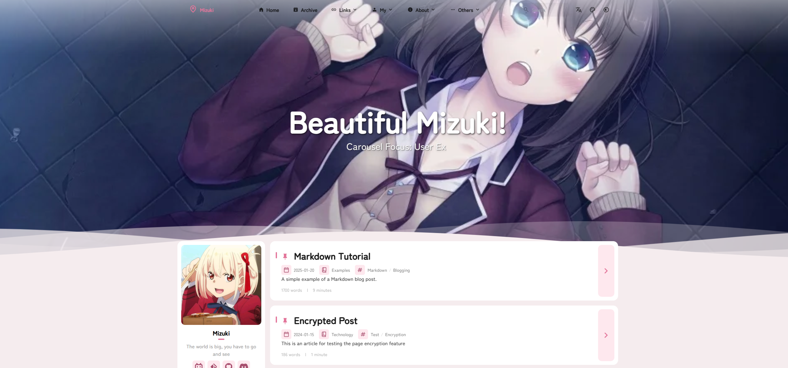
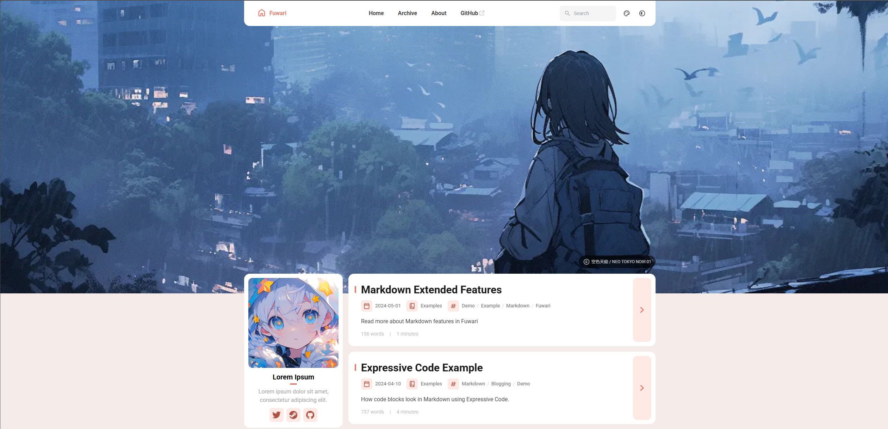
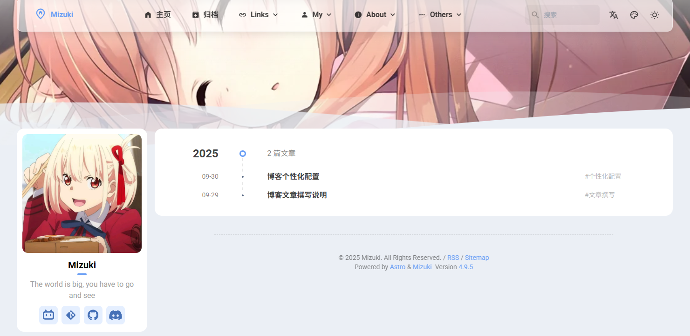
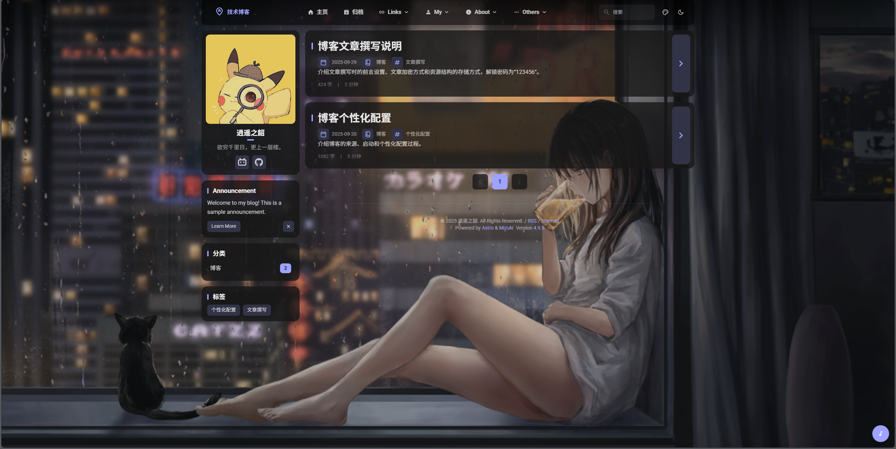
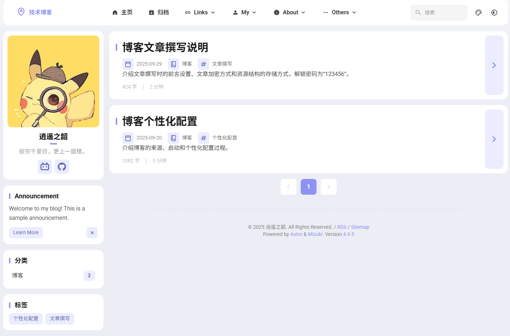

# 1. 来源

​		本博客自[**Mizuki**](https://github.com/matsuzaka-yuki/Mizuki)主题博客改造而来，原作者是[**松坂有希**](https://space.bilibili.com/701864046)；而Mizuki主题，又是从[**Fuwari**](https://github.com/saicaca/fuwari)主题博客改造而来，原作者是[**二叉树树**](https://space.bilibili.com/325903362)。

​		这两个主题都是采用**Astro框架**进行构建。

- **Mizuki主题**



- **Fuwari主题**



# 2. 启动

## 2.1 下载仓库

​		本博客选用的版本是[**Mizuki v7.5**]([Release Mizuki v7.5 Release · matsuzaka-yuki/Mizuki · GitHub](https://github.com/matsuzaka-yuki/Mizuki/releases/tag/7.5)。推荐使用LTS版本，不要使用master版本。

## 2.2 安装npm和pnpm

- 安装**npm**：https://nodejs.org/en ，选择**LTS版本**下载安装，*不需要安装chocolatey*
- 安装**pnpm**

```bash
npm install -g pnpm
```

## 2.3 安装环境依赖

```bash
pnpm install
```

## 2.4 开发、编译与预览

|      命令      | 功能                                             |
| :------------: | :----------------------------------------------- |
|   `pnpm dev`   | 启动**本地开发服务**，运行在`localhost:4321`站点 |
|  `pnpm build`  | **编译生产站点**至`./dist/`                      |
| `pnpm preview` | **在部署前**，**预览**本地编译后的网站状态       |

# 3. 个性化配置

## 3.1 主页名称

​		修改`src/config.ts`中`SiteConfig`配置中的`title`和`subtitle`内容，对应网站主页的**标题**和**副标题**。

## 3.2 主题色

​		修改`src/config.ts`中`SiteConfig`配置中的`themeColor`内容，调整网站的**主题色**。

​		主题颜色对应的是`hue`值，**选取范围**为**0~360**，如：`红色=0`，`青色=200`，`蓝绿色=250`，`粉色=345`等。

## 3.3 Banner壁纸

### 配置修改

​		修改`src/config.ts`中`SiteConfig`配置中的**banner**内容，可以修改网站的**banner**信息。

- **电脑端**：修改`src`中的`desktop`信息，**自定义图像路径**，即可修改**电脑端**图像内容

- **手机端**：修改`src`中的`mobile`信息，**自定义图像路径**，即可修改**手机端**图像内容

### 轮播功能

- **功能开关**：修改`carousel`中的`enable`信息，可以**启动或关闭**壁纸轮播功能
  - **开启**：按**轮播间隔**播放图片
    
  - **关闭**：**随机**显示一张图片

- **轮播间隔**：修改`carousel`中的`interval`信息，可以修改banner图像的**轮播间隔**时间，单位为**秒**

### 高度调整

​		修改 `src/constants/constants.ts` 中的`BANNER_HEIGHT`、`BANNER_HEIGHT_EXTEND`变量的值，可以控制首页壁纸的高度。

​		`MAIN_PANEL_OVERLAPS_BANNER_HEIGHT`为**波浪块**的位置，可在调试时作适配性地调整。

- `BANNER_HEIGHT`为**每一页**的**导航栏到正文**的距离
- `BANNER_HEIGHT_EXTEND`为**首页**的**导航栏到正文**额外追加的距离：
  - 若值为0，则**每一页导航栏到正文的距离**一致，均为`BANNER_HEIGHT`
  - 若值不为0，则**首页的壁纸高度将更高**，但**其他页的壁纸高度保持不变**

#### 推荐方案一

- `BANNER_HEIGHT` = 25，`BANNER_HEIGHT_EXTEN` = 0，`MAIN_PANEL_OVERLAPS_BANNER_HEIGHT` = 25
- **特点**：
  - **每一页导航栏到正文的距离一致，结构整齐**
  - **首页壁纸只能不完整地显示**




#### 推荐方案二

- `BANNER_HEIGHT` = 25，`BANNER_HEIGHT_EXTEND` = 80，`MAIN_PANEL_OVERLAPS_BANNER_HEIGHT` = 25
- **特点**：
  - **首页壁纸全屏显示**
  - **其余页导航栏到正文的距离一致**


## 3.4 Banner标题

​		修改`src/config.ts`中`SiteConfig`配置中的**banner**内容，可以修改网站的**banner**信息。

- **功能开关**：修改`homeText`中的`enable`信息，可以**启动或关闭**标题内容

- **主标题**：修改`homeText`中的`title`信息，可以修改**Banner标题内容**
- **副标题**：修改`homeText`中的`subtitle`信息，可以修改**Banner副标题内容**
  - **打字机效果**：修改`typewriter`信息


## 3.5 头像、名称、介绍、网站

​		修改`src/config.ts`中`ProfileConfig`的内容，可以修改**个人资料**信息。

- **头像**：通过修改`avatar`信息，设置自定义**头像**
  - **头像图片地址**：`src/assets/images/avatar.jpg`
- **名称**：通过修改`name`信息，设置**个人名称**
- **介绍**：通过修改`bio`信息，设置**个人介绍**的内容
- **网站**：通过修改`links`信息，修改**个人网站**的内容
  - `name`：网站名称
  - `icon`：网站图标
  - `url`：网站地址

## 3.6 全屏壁纸

### 配置修改

​		修改`src/config.ts`中`FullscreenWallpaperConfig`的信息，可以设定网站的**全屏壁纸**图片。

- **电脑端**：修改`src`中的`desktop`信息，**自定义图像路径**，可以修改**电脑端**图像内容

- **手机端**：修改`src`中的`mobile`信息，**自定义图像路径**，可以修改**手机端**图像内容

- **功能开关**：

  - `banner模式`为`true`，启用**Banner壁纸轮播**

  - `banner模式`为`false`，启用**全屏壁纸**

    

  - `banner模式`为`false`，不启用**全屏壁纸**，**全屏壁纸**为**空白状态**

    

### 轮播功能

- **功能开关**：修改`carousel`中的`enable`信息，可以**启动或关闭**壁纸轮播功能
  - **开启**：按**轮播间隔**播放图片

  - **关闭**：显示**最后一张**图片
- **轮播间隔**：修改`carousel`中的`interval`信息，可以修改banner图像的**轮播间隔**时间，单位为**秒**

## 3.7 公告

- 如需**使用**，修改`src/config.ts`中`AnnouncementConfig`的内容，即可修改**公告**内容。
  - `title`：**公告标题**
  - `content`：**公告内容**
  - `link`：**公告链接**

- 如**不使用**，则将`sidebarLayoutConfig`的`components`列表中的`announcement`组件的`enable`字段设置为`false`，即可关闭**公告**模块。

## 3.8 导航栏

​		修改`src/config.ts`中`NavBarConfig`的信息，可以修改网站的**导航栏**信息。

​		既可以直接使用**预设**的导航内容，也可以使用**自定义**导航栏链接：以**json**格式编写，支持**多级菜单**形式。

​		**预设导航内容**一览如下：

- `Home`：**主页**
- `Archive`：**文章**
- `Diary`：**日记**
  - 在 `src/pages/diary.astro` 中编辑**日记**内容
- `Albums`：**相册**
  - 在 `public/images/albums` 中生成相册文件夹，更新**相册**内容
- `Anime`：**追番**
  - 在 `src/pages/anime.astro` 中编辑**追番**内容
  - **番剧封面地址**：`src/assets/anime`
- `Game`：**游戏**
  - 在 `src/pages/game.astro` 中编辑**游戏**内容
  - **游戏封面地址**：`src/assets/game`
- `Friends`：**友链**
  - 保留 `src/content/spec/friends.md` 的**空文档** 
  - 在 `src/pages/friends.astro`  中编辑**友链**信息
- `About`：**关于**
  - 在 `src/content/spec/about.md` 中编辑**关于**内容
- ~~`Projects`：**项目**~~（**未启用**）
  - ~~在 `src/data/projects.ts` 中编辑**项目**内容~~
- ~~`Skills`：**技能**~~（**未启用**）
  - ~~在 `src/data/skill.ts` 中编辑**技能**内容~~
- ~~`Timeline `：**时间线**~~（**未启用**）
  - ~~在 `src/data/timeline.ts` 中编辑**时间线**内容~~

## 3.9 樱花特效

​		修改`src/config.ts`中`SakuraConfig`的信息，可以设定网站的**樱花**特效。

​		根据个人喜好，进行**功能启动或关闭**和**参数微调**。

## 3.10 看板娘

### 外部配置修改

​		修改`src/config.ts`中`pioConfig`的信息，可以修改**看板娘**信息。

- `models`：选取**看板娘模型**，使用的是pio方案，可参考：[给你的博客增加动态看板娘](https://paugram.com/coding/add-poster-girl-with-plugin.html)
- `position`：看板娘的**位置**，**左边**或者**右边**
- `width`和`height`：看板娘的**高度**和**宽度**
- `mode`：看板娘**能否拖拽**，`fixed`为固定，`draggable`为可以拖拽

### 内部配置修改

​		修改`public/pio/static/pio.css`中的信息，可以对**看板娘**做一些更深层的修改。

1. 注释`pio-action`的相关字段，可以**关闭看板娘的动作响应**
2. 将`.pio-dialog`中添加`text-align: center;`，可以**让看板娘的字幕居中显示**
3. 将`.pio-dialog.active`的`visibility`属性设为hidden，可以**关闭看板娘的字幕显示**

## 3.11 音乐组件

​		修改`src\components\widget\MusicPlayer.svelte`中的信息，即可修改**音乐组件**的功能。

### 在线音乐模式

- 将`musicPlayerConfig.mode`的值设为`meting`
- 设置`meting_api`的相关参数，即可使用**在线**音乐功能，支持**网易云音乐**、**QQ音乐**、**酷狗音乐**、**虾米音乐**、**百度音乐**

### 本地音乐模式

- 将`musicPlayerConfig.mode`的值设为`local`
- 修改`localPlaylist`的信息，填入**本地**音乐的**音乐文件路径**、**专辑图像路径**及**艺术家名称**，即可进行播放。