# 1. 建立代码仓库，上传代码

## 1.1 选择代码仓库

​		首先需要建立一个`代码仓库`，上传博客代码。常见的代码仓库有`Gitee`和`GitHub`，考虑国内的**法律监管风险**以及`Gitee`已经在**国内停止提供Pages服务**，还是按照常规做法，**在`GitHub`建立代码仓库**，上传源代码。

## 1.2 给代码仓库命名		

​		考虑到GitHub Pages服务的**默认启动目录**，需要**将代码仓库名称直接命名为`<username>.github.io`的形式**，**username**为GitHub账户的用户名。

## 1.3 修改astro.config.mjs

​		把**根目录下`astro.config.mjs`中的`site`字段更新为`https://<username>.github.io`，`base`字段依然保持为`/`**，依照这种设定， **开发环境（`pnpm dev`）** 和 **生产环境（`pnpm build`）** 的调试结果就可以保持一致。

## 1.4 新增gitignore文件

​		由于在开发过程中，需要使用`pnpm install`创建开发环境、使用`pnpm dev`和`pnpm build`进行本地调试，而这些命令产生的内容**不必上传**至代码仓库中，因此，需要**在根目录下创建`.gitignore`文件**，以便在提交代码时，忽略无需上传的内容。

```bash
# build output
dist/

# generated types
.astro/

# dependencies
node_modules/

# logs
npm-debug.log*
yarn-debug.log*
yarn-error.log*
pnpm-debug.log*

# environment variables
.env
.env.production

# content repository (independent mode)
/content/
*.backup

# Large zip files
*.zip

# macOS-specific files
.DS_Store

.vercel

package-lock.json
bun.lockb
yarn.lock

# ide
.idea
*.iml

cache/
fuwari/
src/data/myself.ts
src/pages/myself.astro

```

# 2. 博客部署至GitHub Pages

​		使用**GitHub Actions**功能，提前设计用于构建的**工作流**，在代码提交之后，就可以**自动完成部署过程**、实现将博客托管在**GitHub Pages**的操作。

## 2.1 创建workflows目录

​		在项目的`.github`目录下，创建`workflows`目录，用来存放**Github Actions**所需的工作流。

## 2.2 新增deploy.yml文件

​		在 `.github/workflows/` 的目录里创建一个新文件`deploy.yml`，内容更新如下：

```yaml
name: Deploy to GitHub Pages
on:
  # 每次推送到 `main` 分支时触发这个“工作流程”
  # 如果你使用了别的分支名，请按需将 `main` 替换成你的分支名
  push:
    branches: [ main ]
  # 允许你在 GitHub 上的 Actions 标签中手动触发此“工作流程”
  workflow_dispatch:
# 允许 job 克隆 repo 并创建一个 page deployment
permissions:
  contents: read
  pages: write
  id-token: write
jobs:
  build:
    runs-on: ubuntu-latest
    steps:
      - name: Checkout your repository using git
        uses: actions/checkout@v4
      - name: Install, build, and upload your site
        uses: withastro/action@v3
        # with:
          # path: . # 存储库中 Astro 项目的根位置。（可选）
          # node-version: 20 # 用于构建站点的特定 Node.js 版本，默认为 20。（可选）
          # package-manager: pnpm@latest # 应使用哪个 Node.js 包管理器来安装依赖项和构建站点。会根据存储库中的 lockfile 自动检测。（可选）
  deploy:
    needs: build
    runs-on: ubuntu-latest
    environment:
      name: github-pages
      url: ${{ steps.deployment.outputs.page_url }}
    steps:
      - name: Deploy to GitHub Pages
        id: deployment
        uses: actions/deploy-pages@v4
```

## 2.3 配置Actions功能

​		先在**仓库项目**的`Settings`中将`Build and deployment`的`source`改为`Github Actions`，启动**Github Actions**的功能，然后再在`Actions`里选择配置`deploy.yml`文件。

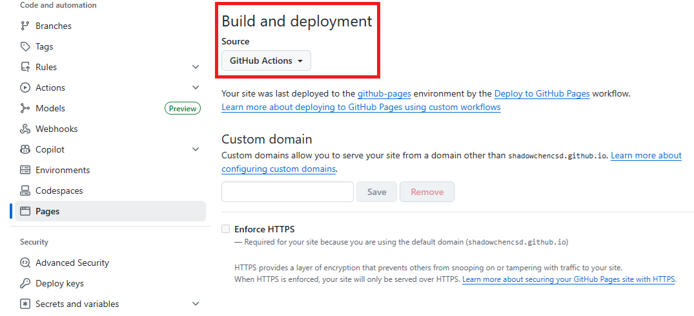

:::tip[构建结果]

​		当一切设置完成后，`GitHub Actions`会在提交代码之后，自动触发部署流程，构建结果也会反馈在页面中。如果上述配置都运作正常，那么`GitHub Actions`会反馈**success**的结果，并且博客也会**自动部署**在`GitHub Pages`服务上，可以通过`<username>.github.io`进行访问了。

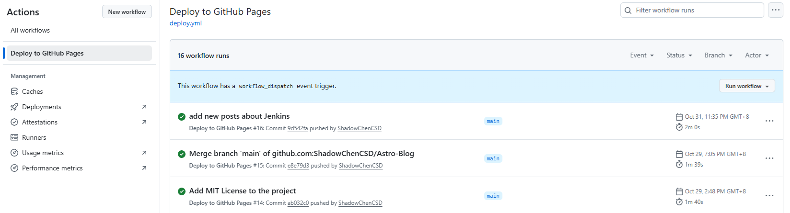

:::

# 3. 博客部署至EdgeOne Pages

​		由于GitHub服务器在境外，经常会发生**服务器不稳定**的情况，导致博客站点**打开速度较慢**，**影响浏览体验**，因此推荐将博客部署在其他服务器上，如**CloudFlare**、**Netify**、**EdgeOne**等，这里就**EdgeOne**方案予以说明，其他方案与其类似。

## 3.1 EdgeOne Pages介绍

### 概述

​		**EdgeOne Pages**是基于腾讯云基础设施打造的**边缘安全加速平台**，专为现代Web开发设计，帮助开发者快速构建、部署`静态站点`和`无服务器应用`。

### 适用场景

- **静态与动态网站托管**：适合使用静态生成器，如**Next.js**、**Hexo**、**Astro**等构建的网站，以及使用**React**、**Vue**等现代前端框架构建的单页应用。

- **构建部署自动化**：通过**GitHub**、**Gitee**等代码管理平台集成，在每次代码提交时自动构建和部署网站，简化开发部署流程，提升研发效率。

## 3.2 EdgeOne账号注册

​		**EdgeOne**有**国内版**和**国际版**之分，基础功能相同：**DDoS防护**、**Web应用防火墙**、**内容分发网络**、**智能加速**等，主要区别在于**费用结算**、**ICP备案**、**账号注册网站**和**访问速度**等：

- **费用结算**
  - **国内版**：使用**人民币**结算
  - **国际版**：使用**美元**结算
- **ICP备案**
  - **国内版**：必须**实名认证**和**ICP备案**，才能对外开放使用，而**ICP备案**需要强制购买**云服务器**才能申请
  - **国际版**：可以不用**实名认证**和**ICP备案**，就可以对外开放使用

- **账号注册网站**
  - **国内版**：官网：<https://cloud.tencent.com>，控制台：<https://console.cloud.tencent.com/edgeone/pages>
  - **国际版**：官网：<https://www.tencentcloud.com>，控制台：<https://console.tencentcloud.com/edgeone/pages>
- **访问速度**
  - **国内版**：全球可访问，**国内网络访问流畅**，但只能使用**3小时有效**的免费域名，如果要用**自定义域名**，必须**实名认证**并**网络备案**
  - **国际版**：全球可访问，**国内网络访问速度不及专线访问速度**，但**比cloudflare、netify、GitHub服务快**，虽然也只能使用**3小时有效**的免费域名，但是支持**不必网络备案**的**自定义域名**

---

​		基于**部署易用性**、**审查机制**和**成本最小化**考量，选择 **`国际版`** 进行账号注册和使用。

​		国际版账号注册后，可以**免费领取**`四个加速计划`，只要**参与活动**、**分享**至`X平台`和`Facebook平台`就行：**点击链接**即可，不用关心是否分享成功。

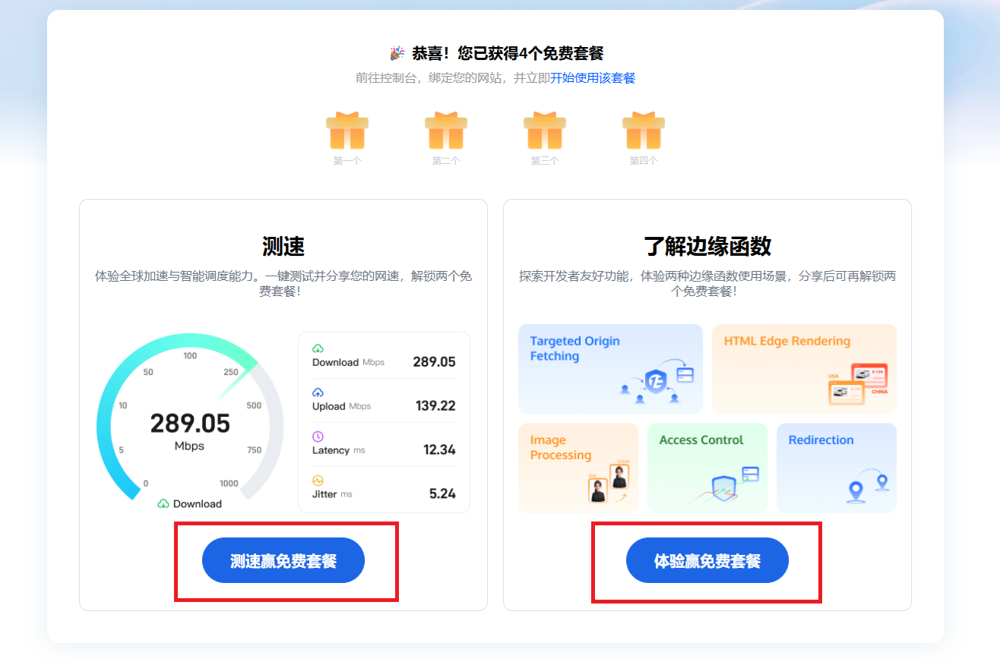

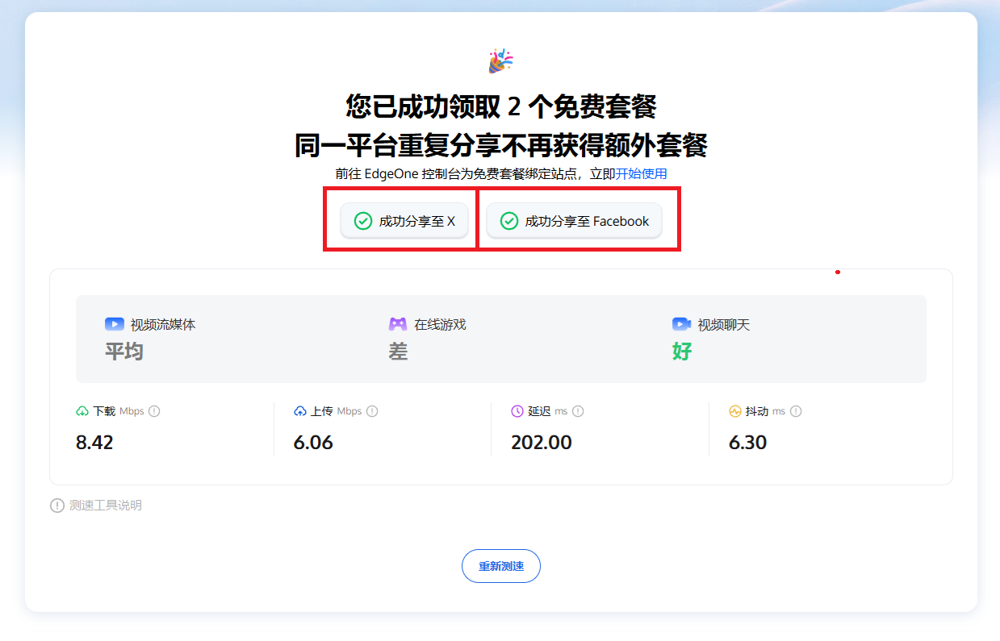

## 3.3 EdgeOne Pages部署Astro博客

​		EdgeOne Pages目前支持**Github**、**Gitee**、**CNB**等**git提供商**的接入。

### 导入Git仓库

- **接入git供应商**：在控制台页面，选择**git提供商**进行接入，此处以`GitHub`为例。

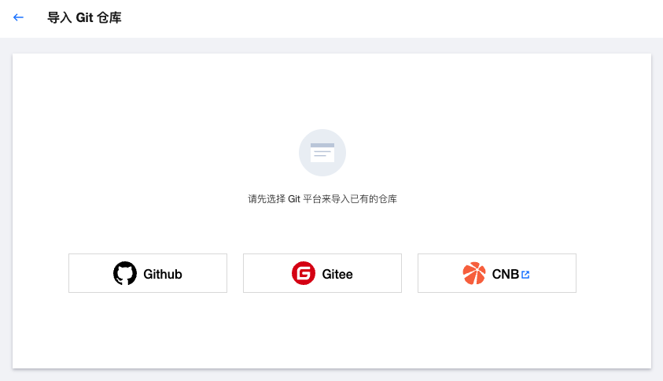

- **授权访问**：授予EdgeOne访问仓库的**权限**。

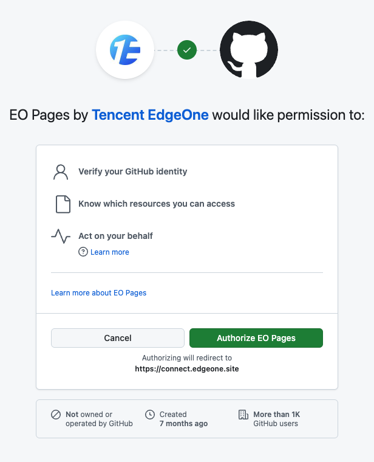

- **选择仓库**：选择**需要部署的仓库**或者**授权所有仓库**。


### 填写构建配置

:::important[关键]

这一步骤对于项目能否`正确编译`和`顺利部署`**至关重要**。

:::

- **选择需要部署的仓库**

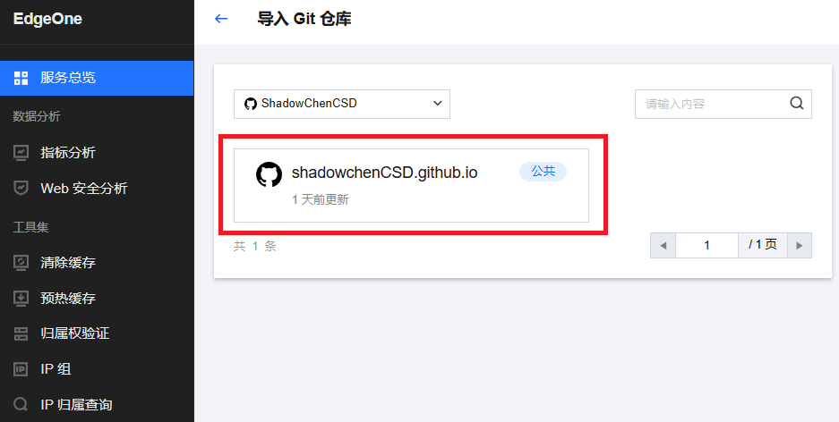

- **确认构建配置项**，确认无误后**开始部署**
- **项目名称**可依照规则，自行命名。
  - **构建设置**使用默认的Astro方案即可，无需更改。

:::tip[提醒]

只有`全球可用区（不含中国大陆）`支持**不用网络备案**的**自定义域名**

:::

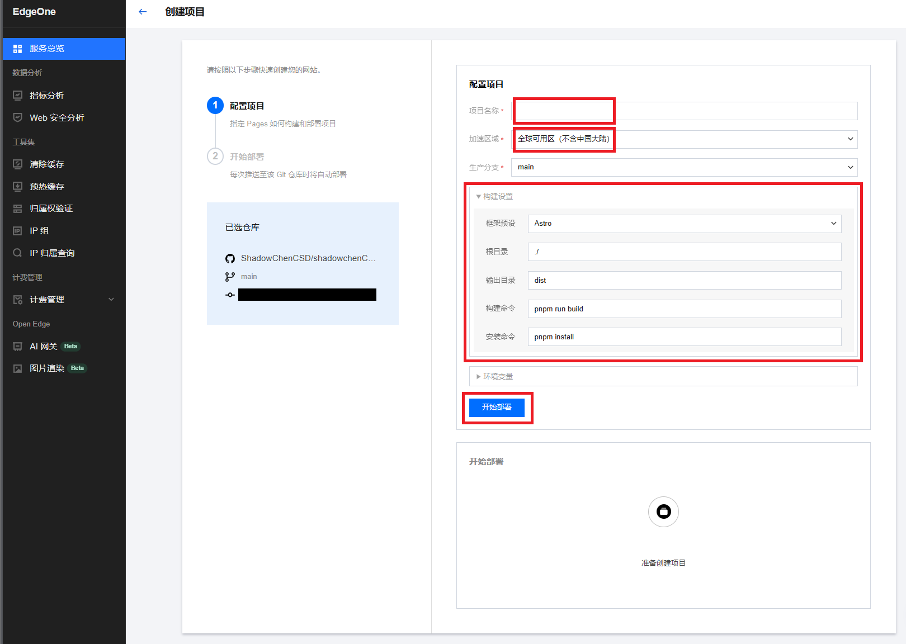

### 查看部署状态

- 在**构建部署**中可以查看**详细**的部署状态

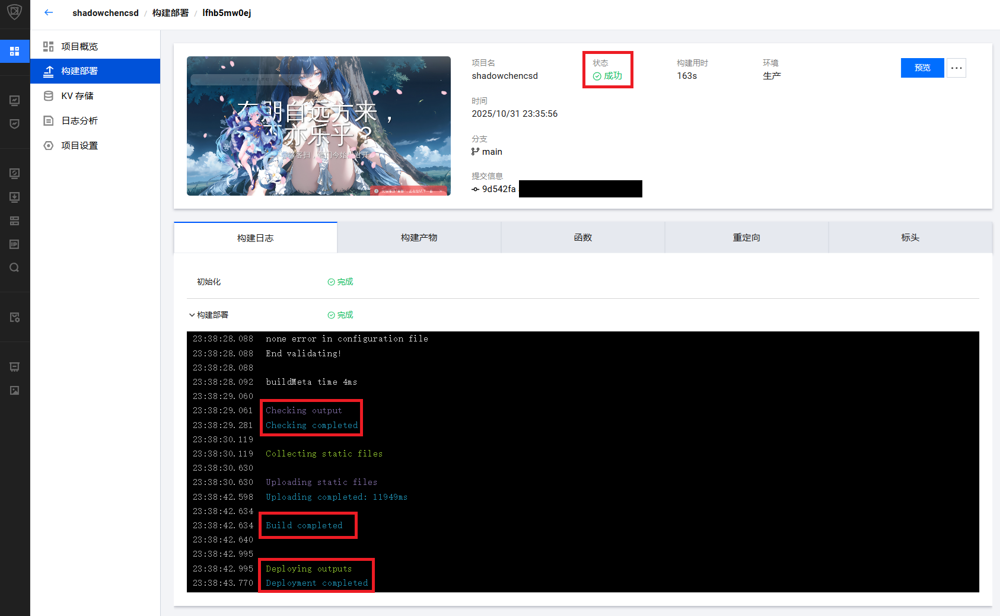

- 在**构建部署**中选择**预览**，可以查看项目部署后的**展示效果**

:::tip[提醒]

预览效果只提供`3小时`的限时免费预览，如需长期访问，需要绑定**自定义域名**。

:::

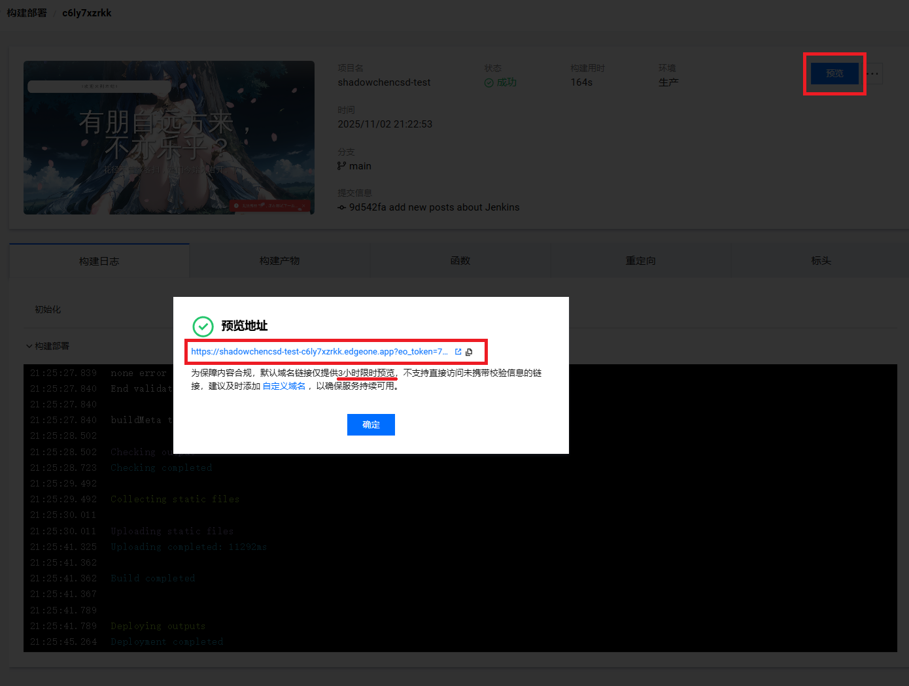

# 4. 购买自定义域名

​		可以在[阿里云](https://wanwang.aliyun.com/domain)、[腾讯云](https://cloud.tencent.com/product/domain)、[AWS](https://aws.amazon.com/cn/campaigns/domain-registration)、[cloudflare](https://domains.cloudflare.com)、[spaceship](https://www.spaceship.com/)等网站购买域名，这里以在`spaceship`上购买域名为例进行介绍。

## 4.1 搜索域名

:::tip[提醒]

如果要在国内`备案`，请优先选用常见的后缀名，如`.com`、`.net`、`.xyz`、`.site`等。使用**小众的后缀名**，有一定概率无法通过国内备案流程。

:::


## 4.2 对比价格

- **横向对比**`各家网站`对`同一域名`给出的价格，货比三家，择优选购
- **纵向考虑**`是否有必要存续更长的时间`，一般**新域名首年**、**新用户首单**都会有划算的价格，但之后域名续费的价格较高，需谨慎考虑

:::tip[提醒]

多数情况下，`域名购买后不予退款`，**下单需谨慎**。

:::

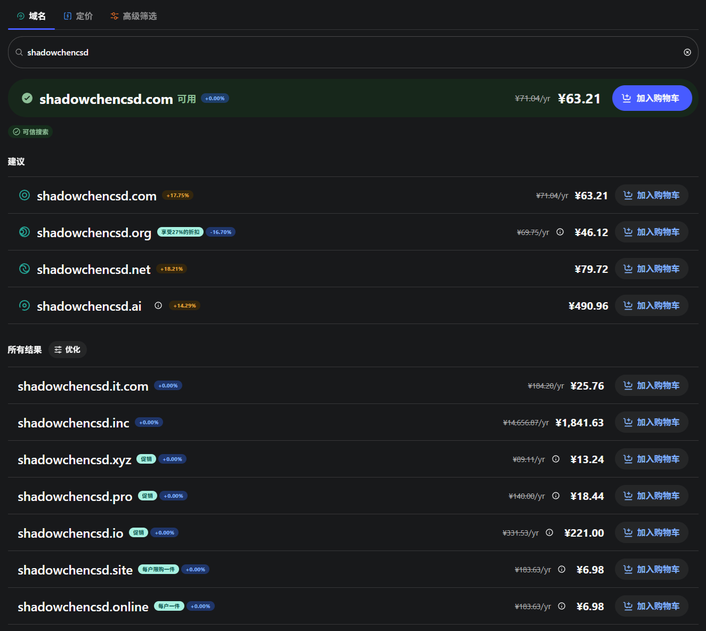

## 4.3 购买完成

- 可以在`域名管理器`里查看`已经购买的域名`

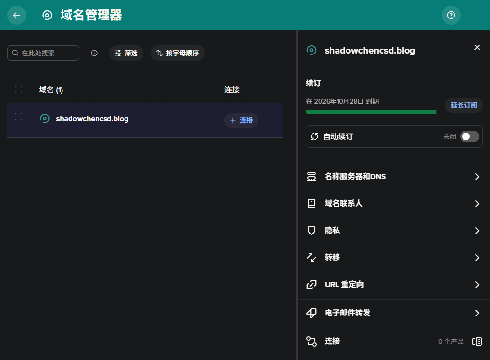

# 5. 将自定义域名配置到EdgeOne Pages

## 5.1 在EdgeOne增加自定义域名

- 在**EdgeOne**的`pages服务`中选择**部署成功的项目**，然后进入`项目设置`页面，选择`添加自定义域名`

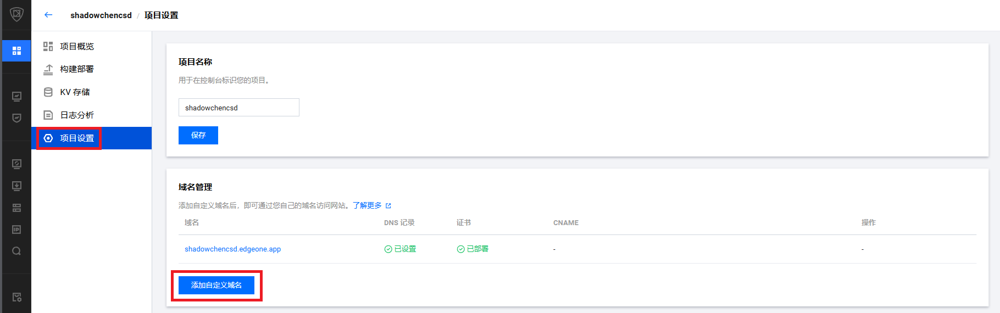

- 在弹出的页面中**输入自定义域名**，如`www.shadowchencsd.blog`，点击**下一步**

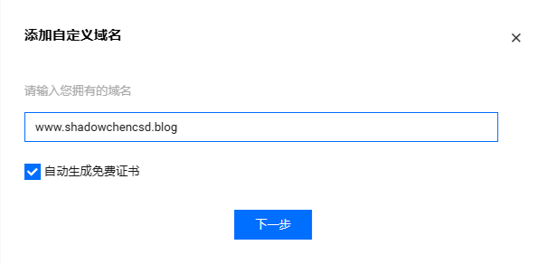

- 在弹出的页面中，复制`记录值`，以用于在**spaceship**配置**CNAME**

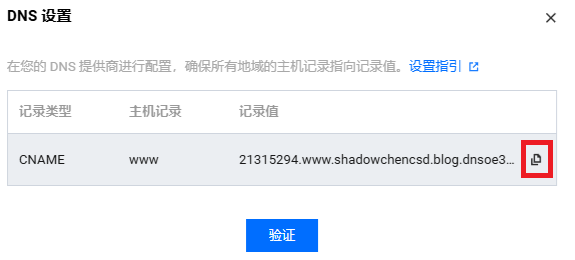

## 5.2 在spaceship配置CNAME

- 在**spaceship**中搜索`高级DNS`功能，选择`购买的域名`，进行**CNAME配置**

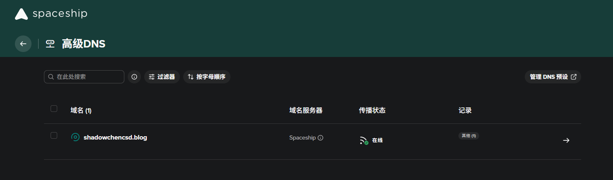

- 在**自定义记录**中`添加记录`，`主机`填写`www`，类型选择`CNAME`，`值`填写**EdgeOne**提供的`记录值`

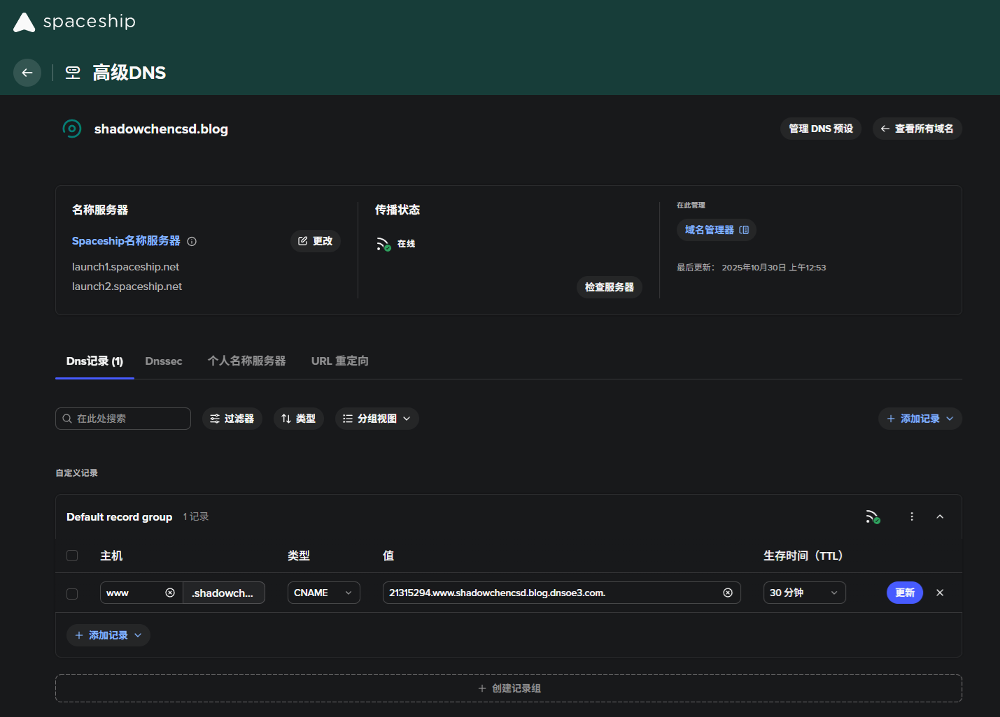

## 5.3 在EdgeOne更新自定义域名

- 在`spaceship`页面**等待DNS广播完成**，直到广播图标出现`✅`

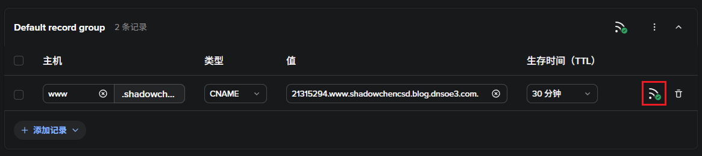

- 切换至`EdgeOne`网站的`项目设置`处，此时新域名的`DNS记录`变为`已设置`状态，点击`验证`进行**DNS记录验证**

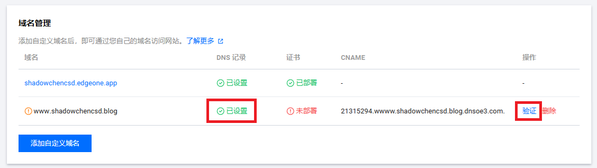

- **验证**通过后，`EdgeOne`会**自动申请**免费的**SSL证书**，用于**托管自定义域名网站**

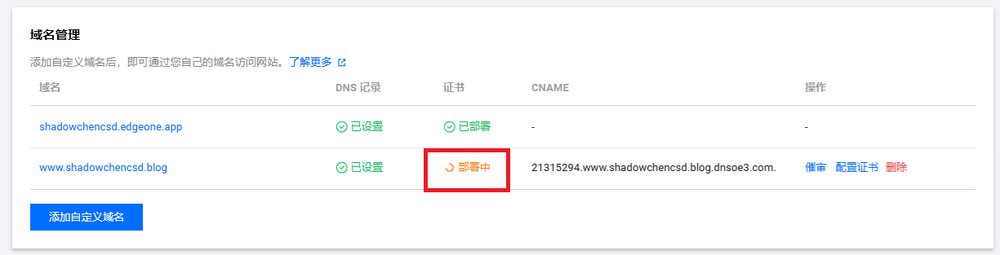

- 等待证书申请完成后，就可以**通过`自定义域名`访问博客站点**了

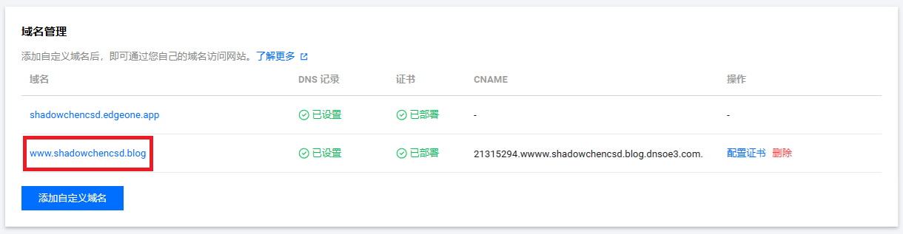