# 1. 介绍

​		**Step1X-Edit**是一个开源的图像编辑模型，作者宣称其性能可以对标**GPT-4o**和**Gemini2 Flash**等闭源模型。

​		**图像编辑模型**是新的图像生成方案，它有别于以往的图像处理技术：

- 相比传统的PhotoShop修改图像的做法，图像编辑模型**不需要手动操作图层和蒙版**，只要**根据用户提供的指令，AI就可以自行找到相应区域并作修改**。
- 相比以往的、以Midjourney和StableDiffusion为代表的生图方案，都是采用扩散模型进行生图，既可以完成**图生图的修改任务**，也可以完成**文生图的创造任务**，但在图像编辑模型下，它**只擅长于对图像进行修改编辑**，而不擅长通过文本方式进行图像生成。
- 得益于大模型的技术发展，Step1X除了能像Midjourney和StableDiffusion一样去**解析英文语言**，还**能够解析中文语言**，用户体验良好。

# 2. 项目部署

## 2.1 下载工程

```bash
git clone https://github.com/stepfun-ai/Step1X-Edit.git
```

## 2.2 构建开发环境

```bash
# 构建conda环境
conda create -n Step1X python==3.10.0

# 进行conda环境
conda activate Step1X

# 安装torch环境
pip install torch==2.5.1 torchvision==0.20.1 torchaudio==2.5.1 --index-url https://download.pytorch.org/whl/cu121

# 安装环境依赖
pip install -r requirements.txt

# 从flash-attention的仓库里下载安装包：https://github.com/Dao-AILab/flash-attention/releases

# 安装flash-attention
pip install flash_attn-2.7.2.post1+cu12torch2.5cxx11abiFALSE-cp310-cp310-linux_x86_64.whl
```

## 2.3 部署注意事项

- 注意显存使用量：**原始版本**需要**50GB**的显存量，**FP8量化+offload**的情况下也要**18GB**的显存量
- 必须要安装**flash_attn**，官方推荐使用的是**flash attention 2**
- 官方提供模型下载渠道：[**modelscope**](https://www.modelscope.cn/models/stepfun-ai/Step1X-Edit)和[**huggingface**](https://hf-mirror.com/stepfun-ai/Step1X-Edit)，**modelscope的下载速度似乎更快一些**

# 3. 实验：H20 vs 4090

## 3.1 运行环境

- **硬件环境**
  - H20：单卡 96 GB显存
  - 4090：单卡 24 GB显存

- **软件环境**
  - H20：完整运行
  - 4090：FP8+offload方式运行（通过**命令行参数**指定）

## 3.2 **提示词**

1. **给这个女生的脖子上戴一个带有红宝石的吊坠。**
2. **让她哭。**
3. **外套改用头层小牛皮制作。**
4. **将图像转换为漫画风格。**
5. **将文本 'TRAIN' 替换为 'PLANE'。**

## 3.3 种子

- **固定值**：1234

## 3.4 生图效果

|         原始图像          |                H20生成图像                 |                 4090生成图像                 |
| :-----------------------: | :----------------------------------------: | :------------------------------------------: |
| 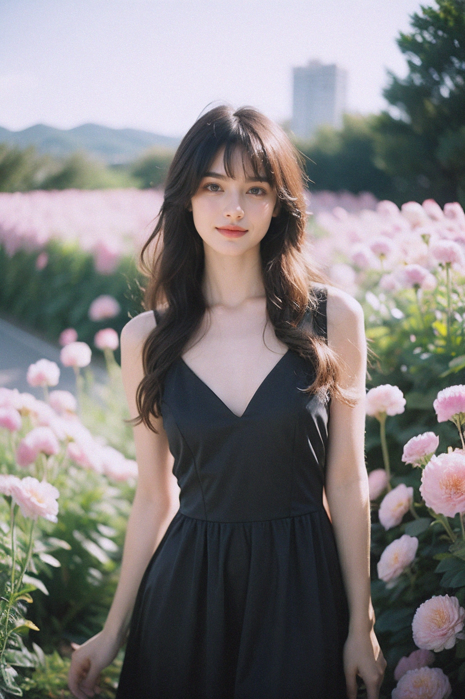 | 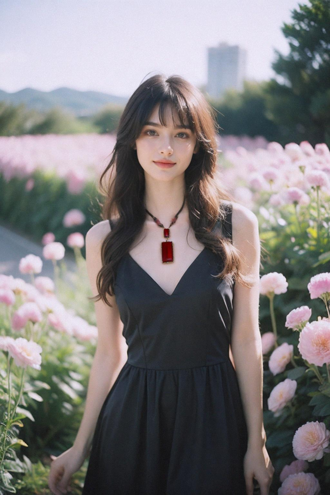 | 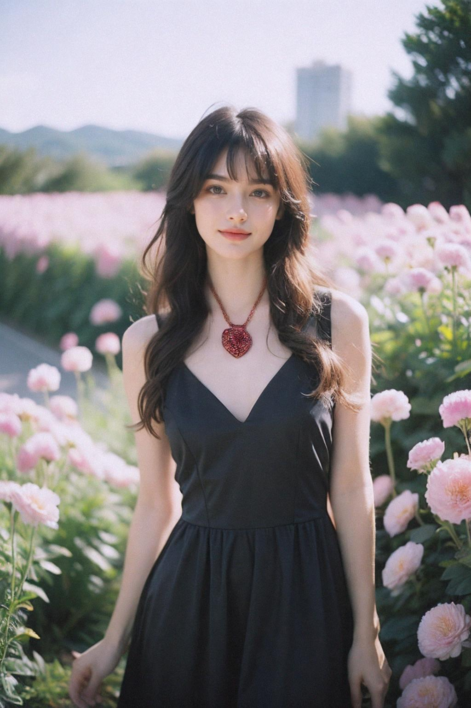 |
|  |  |  |
|  |  |  |
| 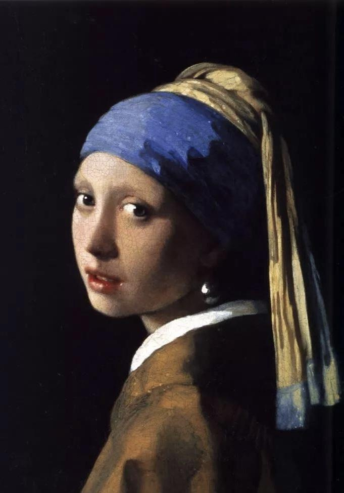 | 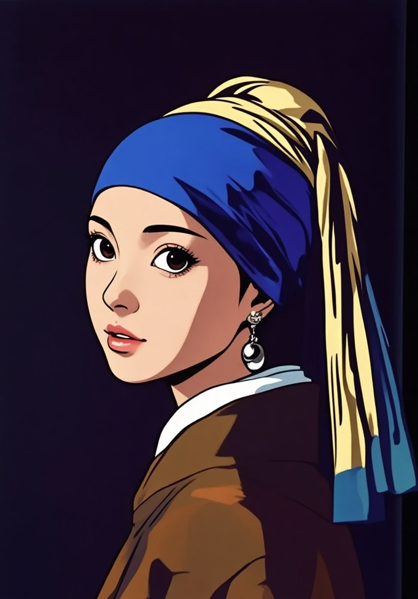 | 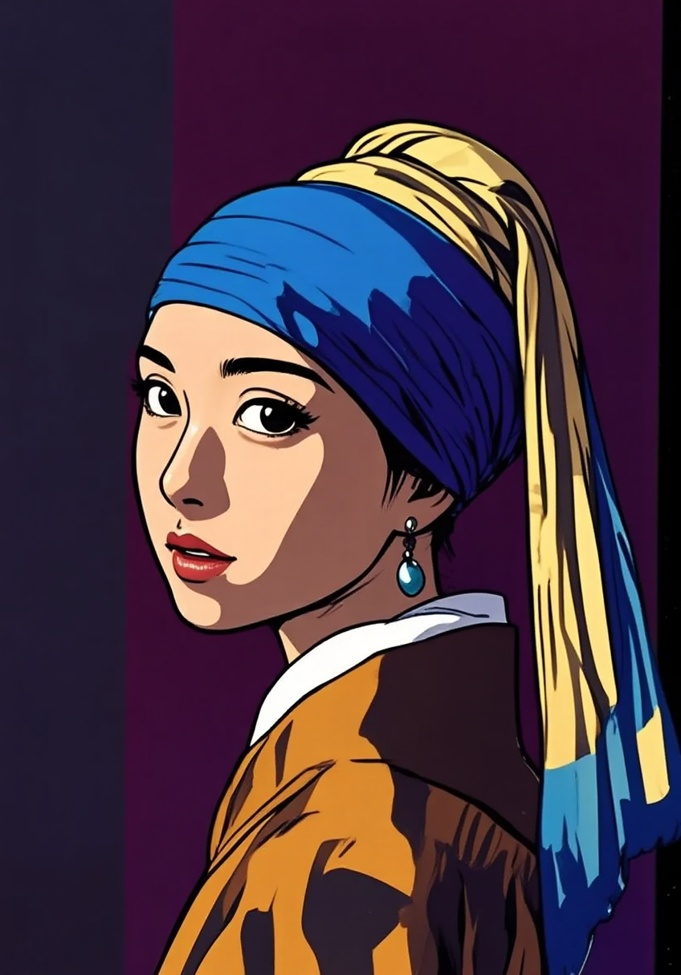 |
|  |  |  |


## 3.5 运行时间差异

- H20：**88.995** sec/image
- 4090：**95.885** sec/image


# 4. 实验：其他数据

## 4.1 运行环境

- **硬件环境**：H20：单卡 96 GB 显存
- **软件环境**：H20：完整运行

## 4.2 提示词

1. **给图像中的人物戴上一顶遮阳帽**
2. **将图像中人物的头发发色改成淡蓝色**
3. **将图像中的苹果全部换成橙子**
4. **将图像转换成新海诚导演的动画风格**
5. **将图像转换成水彩风格**
6. **将图像中的'Happy Birthday'字符替换成'Level 30 Unlocked'**
7. **将图像中的'AIGC'，更换成其它英文：'Merry Christmas'。**
8. **将图像中的'AIGC'字符去除**

## 4.3 生图效果

|         原始图像          |                生成图像                 |
| :-----------------------: | :-------------------------------------: |
|  | 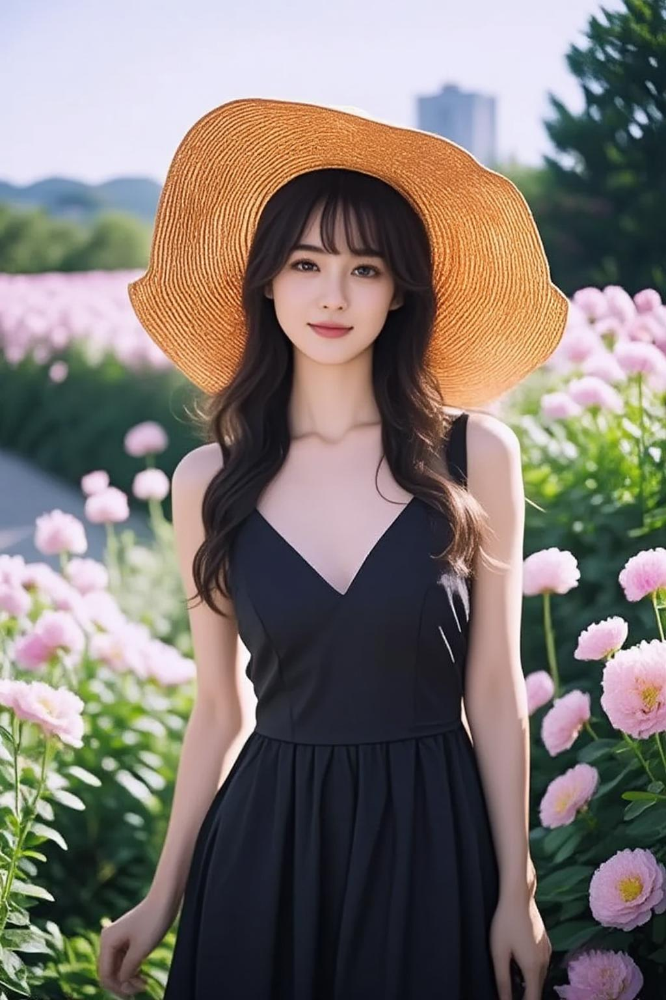 |
|  |  |
| 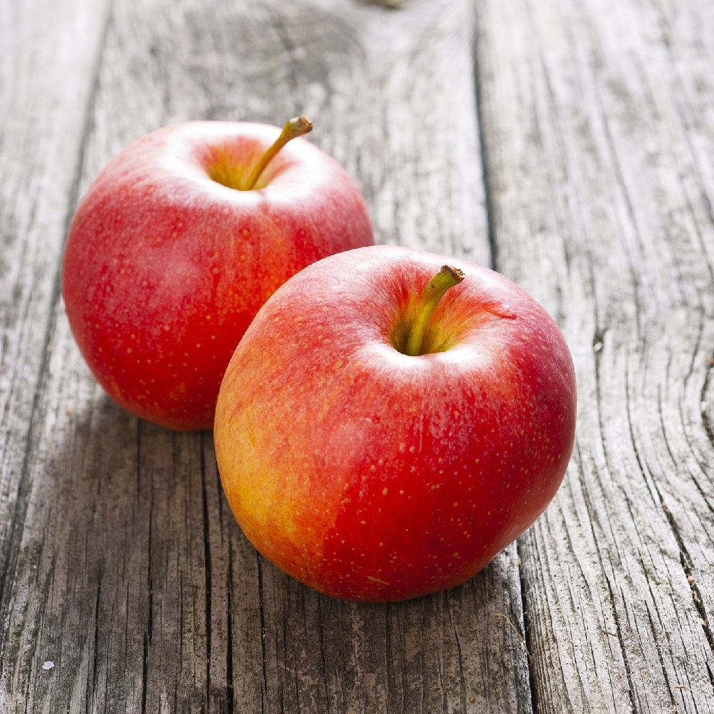 | 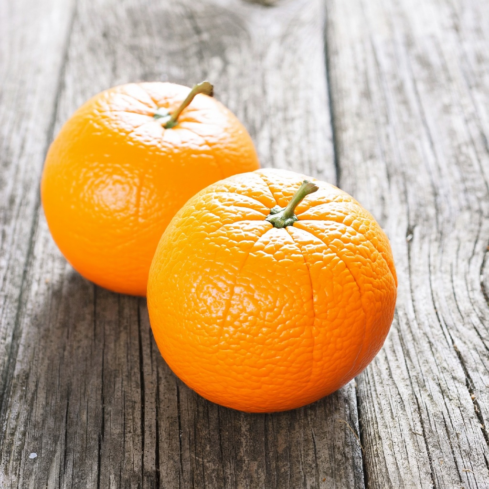 |
| 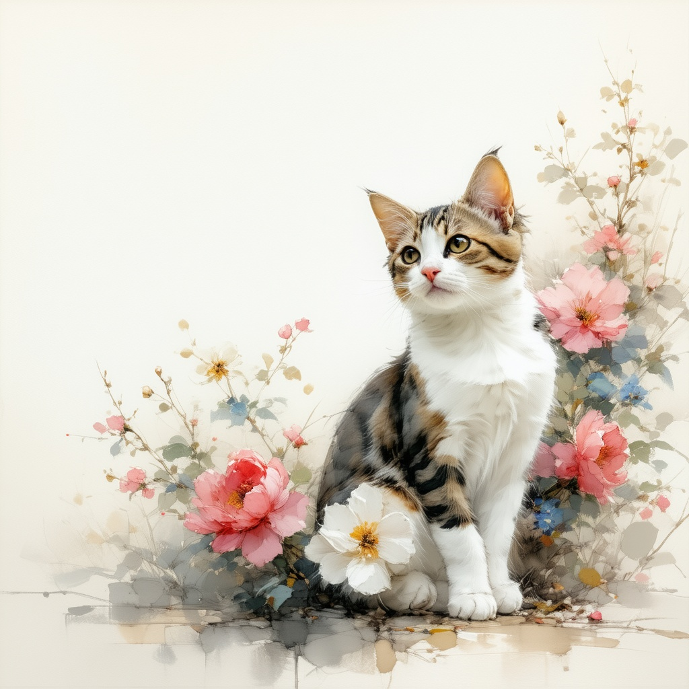 |  |
|  | 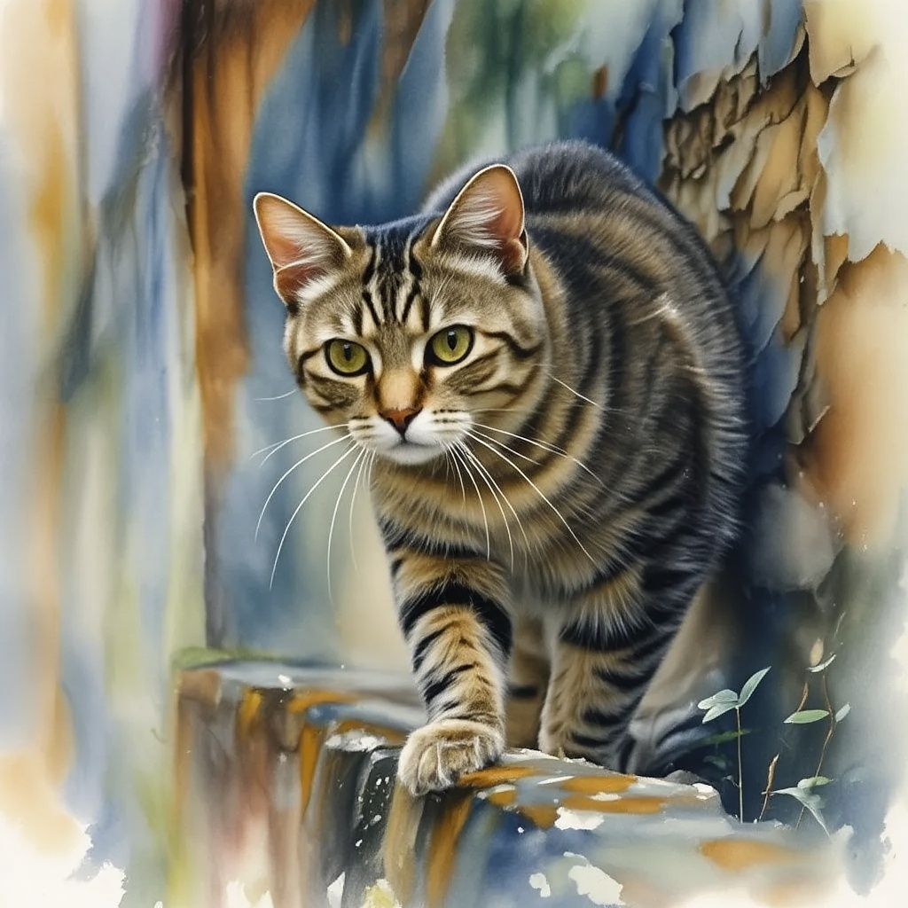 |
|  |  |
|  |  |
|  |  |