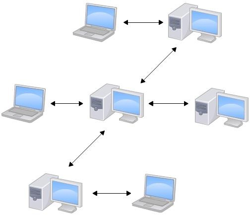
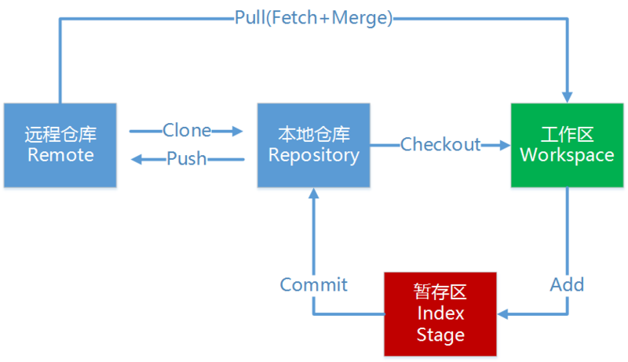
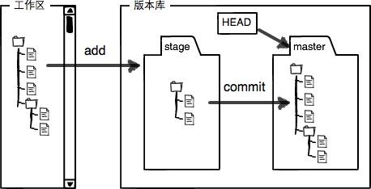
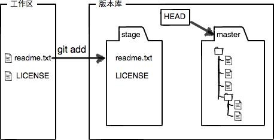
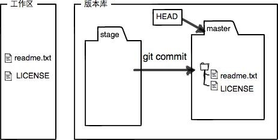
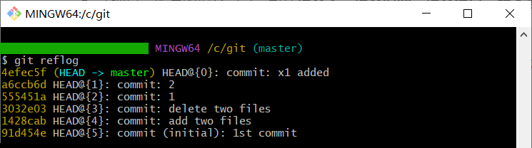

# 1. 介绍

​		**Git**是目前**世界上使用最广泛、最先进**的 **`分布式版本控制系统`** ，**`每个开发者都拥有项目完整的、功能齐全的本地存储库副本，包括所有历史记录`**，即使**没有网络连接**，开发者仍然可以**在本地进行提交、查看历史、创建分支等**几乎所有操作，**与远程仓库的同步只需要在需要时进行**。


# 2. 工作特点



|                |                           工作特点                           |
| :------------: | :----------------------------------------------------------: |
|  **获取更新**  |    **从中央服务器取得文件最新的版本，再进行编辑和修改。**    |
|    **提交**    | **可不断地在本地对文件进行更新和提交，只在必要的时候再推送给中央服务器。** |
|    **缺点**    |                  **`没有严格的权限控制`。**                  |
|    **优点**    |                **`短暂离线状态不影响工作`。**                |
| **中央服务器** | **建议配备**，以方便记录成员的修改。如果没有配备，不影响工作内容，但较难获得达成共识的稳定版本。 |
|   **版本号**   |               依据**SHA1散列函数**计算得到的值               |

# 3. 安装与配置

## 3.1 安装Git

- [Windows](https://git-scm.com/download/win)

- [Linux](https://git-scm.com/download/linux)：**Debian**/ **Ubuntu**

  ```bash
    sudo apt-get install git
  ```

- [MacOS](https://git-scm.com/download/mac)：推荐使用**Homebrew**安装，或者**Xcode**安装。

## 3.2 配置Git账号

- **目的**：作为代码提交、获取、修改时的角色记录。
- **方法**：

```bash
git config user.name "xxx"
git config user.email "xxx@xxx.com"
```

## 3.3 配置本地仓库（local Repository）

### init方案

1. 打开终端
2. 切换到准备当作本地仓库的目录
3. 使用`git init`命令，即可将这个目录变成git管理的本地仓库，同时会生成一个 **.git** 文件夹，用于记录版本变化

### clone方案

1. 打开终端
2. 切换到准备当作本地仓库的目录
3. 使用`git clone xxx@xxx.com:xxxxxx `命令获取远程仓库至本地，并形成本地账户

## 3.4 配置远程仓库（remote Repository）

- 本地仓库和远程仓库之间，是通过SSH进行加密传输的。

- 目前的平台有**GitHub**、**GitLab**、**Gitee**等

  - **GitHub**：基于git实现在线代码托管的仓库，向互联网开放，共有仓库免费，私有仓库收费。
  - **GitLab**：基于git实现在线代码托管的仓库，共有仓库和私有仓库都免费，而且可以部署在自己的服务器上。
  - **Gitee**：OSChina免费给企业用的，不用自己搭建环境，可以建立自己的私有仓库，由开源中国社区推出的基于git的代码托管服务平台。

### 场景1：`先有本地仓库，再有远程仓库`，实现远程仓库和本地仓库的`关联`

1. 通过`git init`创建本地仓库

2. 通过网站的选项，创建远程仓库

3. 关联本地仓库和远程仓库。远程库的名字是`origin`，这是git默认的叫法。

   ```bash
   SSH协议: git remote add origin git@github.com:UserName/RepositoryName.git
   或者
   HTTPS协议: git remote add origin https://github.com:UserName/RepositoryName.git
   ```

4. 获取代码

   ```bash
   git pull origin "分支名"
   # git pull origin master
   ```

   如果`git pull`提示`no tracking information`，则说明本地分支和远程分支的链接关系没有创建，使用下述命令：

   ```bash
   git branch --set-upstream-to "分支名" origin/"分支名" 
   ```

5. 提交代码

   ```bash
   git push origin "分支名"
   # git push origin master
   ```

### 场景2：`先有远程仓库`，`再从远程仓库拉取到本地仓库`

1. 通过网站的选项，创建远程仓库

2. 获取远程仓库代码

   ```bash
   SSH协议: git clone git@github.com:UserName/RepositoryName.git
   或者
   HTTPS协议: git clone origin https://github.com:UserName/RepositoryName.git
   ```
   

# 4. 基本操作



## 4.1 工作区和暂存区

- **工作区**（Working Directory）：个人电脑里管理的目录
- **暂存区**（Stage）：git版本库管理的目录



## 4.2 查看状态：`git status`

- 查看上次提交之后是否有对文件进行再次修改。

## 4.3 添加：`git add file1 file2 file3 ...`

- 添加文件，从工作区添加到暂存区



## 4.4 提交：`git commit file1 file2 file3 ... -m "message" `

- 提交文件，从暂存区提交至本地仓库
- 必须使用`-m`参数，填写提交记录



## 4.5 查看内容差分

- **命令：**`git diff file `
  - 显示**工作区和暂存区**的差异
- **命令：**`git diff --staged file `
  - 显示**暂存区和本地仓库**的差异

## 4.6 查看Log记录

- **命令：**`git log `
  - 详细显示所有的提交记录，包括**提交人、提交时间、提交信息、版本号**
- **命令：**`git log file1 file2 file3 ... `
  - 详细显示指定文件的提交记录，包括**提交人、提交时间、提交信息、版本号**
- **命令：**`git reflog `
  - 简略显示所有的提交记录，包括**提交信息、版本号**
- **命令：**`git reflog file1 file2 file3 ...`
  - 简略显示指定文件的提交记录，包括**提交信息、版本号**

## 4.7 反悔

- **改乱了工作区某个文件的内容，想直接丢弃工作区的修改**
  - **`文件被修改了，但还没add`**
  - `git restore --staged  file`
- **不但改乱了工作区某个文件的内容，还添加到了暂存区时，想丢弃修改**
  - **`文件被修改了，已经add了，但还没commit`**
  - `git restore --staged file`
- **提交了不合适的修改到本地版本库中，想要撤销本次提交**
  - **`文件被修改了，已经add了，已经commit了，但还没push`**
  - `git reset --hard HEAD^`（仅切换到上一版本）

# 5. 版本切换

## 5.1 使用`git reflog`查看版本信息：`HEAD`表示**当前版本**



## 5.2 通过HEAD版本进行切换

|                |           方案一           |          方案二           |
| :------------: | :------------------------: | :-----------------------: |
| 回退上一个版本 |  `git reset --hard HEAD^`  | `git reset --hard HEAD~1` |
| 回退上两个版本 | `git reset --hard HEAD^^`  | `git reset --hard HEAD~2` |
| 回退上三个版本 | `git reset --hard HEAD^^^` | `git reset --hard HEAD~3` |
|      ...       |            ...             |            ...            |

## 5.3 通过指定版本进行切换

举例：`git reset --hard 555451a`

- **git reset** 命令参数
  
  - **git reset --soft**：只在本地库移动HEAD指针
  - **git reset --mixed**：在本地库移动HEAD指针，重置暂存区
  - **git reset --hard**：在本地库移动HEAD指针，重置暂存区，重置工作区

# 6. 分支管理

## 6.1 基本操作

- **查看分支**：`git branch`
  - 列出所有分支，当前分支前面会标记 **\***
- **创建分支**：`git branch 分支名`
- **切换分支**：`git switch 分支名`
- **创建新分支并切换至新分支**：`git switch -c 分支名`
- **合并分支**：`git merge 分支名`
  - 合并指定分支到当前分支
- **删除分支**：`git branch -d 分支名`、`git branch -D 分支名`

## 6.2 作业流程

|             步骤             |                        图例                        |
| :--------------------------: | :------------------------------------------------: |
|          查看主分支          |                  |
| 创建开发分支并切换至开发分支 |  |
|         开发分支更新         |                  |
|         切换至主分支         |              |
|      主分支合并开发分支      |                  |
|         删除开发分支         |                  |

## 6.3 冲突与解决

- **冲突产生**

  - 当 **主分支** 和 **开发分支** 各自都分别有新的提交时，**尝试快速合并会产生冲突**

  

- **冲突处理**

  - 查看冲突文件内容
  - 修改冲突文件

- **冲突解决**

  - add并commit冲突文件

  

- 可利用 `git log --graph --pretty=oneline --abbrev-commit` 查看分支合并图

## 6.4 [快进](https://blog.csdn.net/shinigami2/article/details/125345059)

- 当合并分支时，加上 **–no-ff** 参数就可以用普通模式合并，合并后的历史有分支，能看出来曾经做过合并，而默认使用的 **-ff** 合并就看不出来曾经做过合并。

|   git merge dev / git merge -ff dev    |              git merge --no-ff dev               |
| :------------------------------------: | :----------------------------------------------: |
|  |  |

# 7. TAG标签管理

## 7.1 新建标签

- `git tag <tagname>`：给master版本打标签
- `git tag <tagname> commit_id`：给指定版本打标签
- `git tag <tagname> commit_id -m "message"`：给指定版本打标签

## 7.2 删除标签

- `git tag -d <tagname>`：删除一个本地标签
- `git push origin :refs/tags/<tagname>`：删除一个远程标签

## 7.3 查看所有标签

- `git tag`

## 7.4 查看指定标签信息

- `git show <tagname>`

## 7.5 推送标签至远程

- `git push origin <tagname>`

## 7.6 推送所有标签至远程

- `git push origin --tags`

# 8. 自定义

## 8.1 忽略特殊文件

- 把要忽略的文件名填进`.ignore`，git就会自动忽略这些文件。

- **[官方推荐](https://github.com/github/gitignore)**

- **原则**

  - **忽略操作系统自动生成的文件**，如缩略图
  - **忽略编译生成的中间文件、可执行文件**
  - **忽略带有敏感信息的配置文件**，如密码、口令

- **举例**

  ```bash
  # 排除
  .*      # 排除所有.开头的隐藏文件
  *.class # 排除所有class类型文件
  
  # 不排除
  !.gitignore
  !App.class
  ```

## 8.2 设置别名

- **项目内有效**：更新内容存储在 **.git/config** 的子项 **[alias]** 中

```bash
git config alias.命令新的名称 "git命令"
```

- **全局有效**：更新内容存储在 **C:\Users\\$user\\.gitconfig** 或 **/etc/.gitconfig** 的子项 **[alias]** 中

```bash
git config --global alias.命令新的名称 "git命令"
```

## 8.3 管理公钥

[Gitosis插件](https://github.com/res0nat0r/gitosis)

## 8.4 管理访问权限

[Gitolite插件](https://github.com/sitaramc/gitolite)