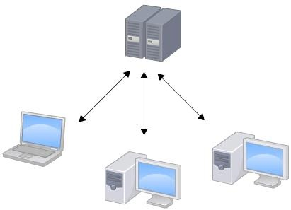
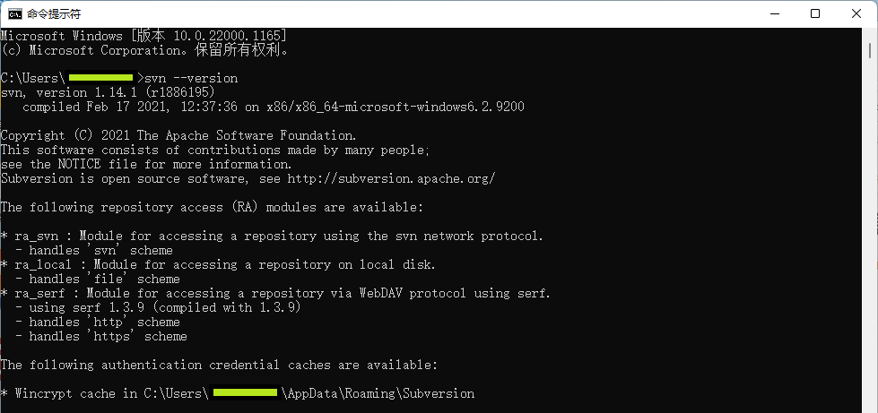

# 1. 介绍

​		**SVN**，全称 **Subversion**，它是一个**开源**的 **`集中式版本控制系统`** ，主要用于**维护项目（源代码或文档）的 `当前版本` 和 `历史版本` **。它允许团队**查看文件先前的版本**，并**跟踪其随时间所发生的所有变化**。


# 2. 工作特点



|                |                           工作特点                           |
| :------------: | :----------------------------------------------------------: |
|  **获取更新**  |    **从中央服务器取得文件最新的版本，再进行编辑和修改。**    |
|    **提交**    |        **修改完成后，将改好的文件提交给中央服务器。**        |
|    **缺点**    | **必须联网才能工作：`一旦中央服务器崩溃，所有人都无法更新文件`。** |
|    **优点**    |             **对`访问成员`有`更好的权限控制`**。             |
| **中央服务器** |      **必须配备**：`需要保证能够稳定运行，故障率要低`。      |
|   **版本号**   |                     按**自然数序**号递增                     |

# 3. 客户端工具

## 3.1 TortoiseSVN（Windows）

利用TortoiseSVN工具，实现对SVN的操作：[官方网站](https://tortoisesvn.net/)

## 3.2 VisualSVN（Windows）

### 下载SVN命令行工具

从 [下载链接](https://www.visualsvn.com/downloads) 中选择 “**Apache Subversion Command-Line Tools**” 进行下载，得到安装包。

### 解压缩

解压缩程序包。建议解压至 **C:\Program Files (x86)** 中。

### 设置PATH

1. 打开**查看高级系统设置**
2. 点击**环境变量**
3. **追加PATH中的内容**，**路径**：如果在上一步骤中程序解压至 **C:\Program Files (x86)** 中，则路径为 **C:\Program Files (x86)\Apache Subversion\bin**；如果解压至其他路径则类似填写

### 确认SVN的安装

1. 打开**命令提示符**

2. 输入命令`svn --version`，如果**提示相应的版本**，说明svn命令行工具可以正常使用了；如果提示**“svn”不是内部或外部命令，也不是可运行的程序或批处理文件名**，说明svn命令行工具没有配置成功，需要重新审核配置过程。

   

## 3.3 subversion（Linux）

```bash
sudo apt-get install subversion
```

# 4. 使用命令

## 4.1 导出：checkout（co）

```bash
svn checkout 路径
```

## 4.2 添加：add

```bash
svn add 文件名 # 文件add后，需要commit后，才会对svn服务器产生影响
```

## 4.3 提交：commit（ci）

```bash
svn commit 文件名 -m "提交信息"
```

## 4.4 更新：update（up）

```bash
svn update # 更新到最新版本
svn update -r [指定版本] # 更新到指定版本
```

## 4.5 删除：delete（del、remove、rm）

```bash
svn delete 文件名 # 注意：文件delete后，需要commit后，才会对svn服务器中的文件产生影响
```

## 4.6 加锁和解锁：lock & unlock

```bash
svn lock 文件名 -m "提交信息"
svn unlock 文件名
```

## 4.7 查看文件、目录的状态：status（st）

**查看上次提交之后是否有对文件进行再次修改。**

```bash
svn status
```

- **不显示**：没有修改
- **?**：不在svn的控制中
- **M**：内容被修改
- **C**：发生冲突
- **A**：预定加入到版本库
- **K**：被锁定

## 4.8 差分文件：diff

```bash
# 版本间的文件内容差分
svn diff -r 旧版本号:新版本号 具体文件名 指定SVN的路径链接
# 举例
svn diff -r 2201:2250 config.xml 指定SVN的路径链接

# 版本间的文件列表差分
svn diff -r 旧版本号:新版本号 --summarize 指定SVN的路径链接
# 举例
svn diff -r 2201:2250 --summarize 指定SVN的路径链接

# 日期间的文件内容差分
svn diff -r {旧日期}:{新日期} 具体文件名 指定SVN的路径链接
# 举例
svn diff -r {2022-10-30}:{2022-11-01} config.xml 指定SVN的路径链接

# 日期间的文件列表差分
svn diff -r {旧日期}:{新日期} --summarize 指定SVN的路径链接
# 举例
svn diff -r {2022-10-30}:{2022-11-01} --summarize 指定SVN的路径链接
```

**版本号**可使用**SVN关键字**：

- **HEAD**：版本库中最新的版本

- **BASE**：某个工作副本项的版本，注意这个是你上次update该项时的版本号，可能晚于当前最新的版本号

- **COMMITTED**：某个工作副本项最近修改的版本，与BASE相同或更早

- **PREV**：**COMMITTED** - 1

## 4.9 查看日志：log

```bash
svn log # 查看所有文件的变动记录
svn log 文件名 # 查看指定文件的变动记录
```

- 该命令还有更详细的细分子项，以控制记录的显示范围，自行按需查询具体子项的使用方法。

## 4.10 查看文件详细信息：info

```bash
svn info # 查看版本库的信息
svn info 文件名 # 查看版本库中指定文件的信息
```

- 该命令还有更详细的细分子项，以控制信息的显示范围，自行按需查询具体子项的使用方法。


## 4.11 帮助：help（h）

```bash
svn help # 全部功能选项
svn help 指定指令 # 具体功能的说明
```

## 4.12 查看更新状态：info

```bash
svn info svn_path --show-item last-changed-revision # 获取SVN的最新更新版本号
svn info svn_path --show-item last-changed-date     # 获取SVN的最新更新日期
svn info svn_path --show-item last-changed-author   # 获取SVN的最新更新人
```