# 1. 网络拓扑结构

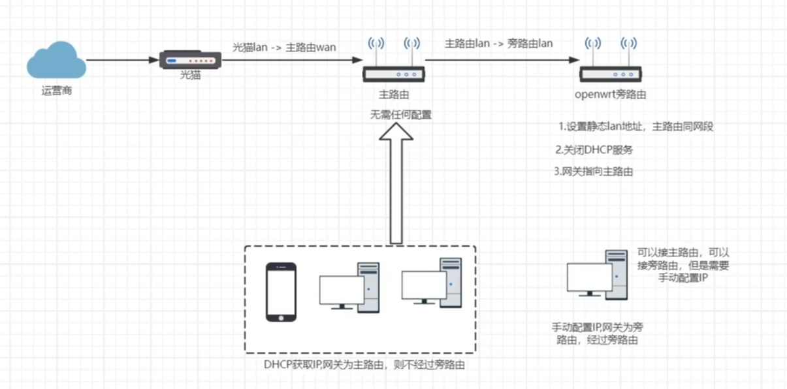

:::important[核心思想]

通过将**树莓派**刷入**OpenWrt系统**后作为**旁路由**使用，在旁路由里加载**open-clash插件**，实现**科学上网**。

:::

**解决方案**：采用**非侵入式**的工作方式

- **主路由无需任何配置**
  - 一般设备连入主路由后，即可通过主路由进行上网
- **旁路由需要进行手动配置**，主要设置：**静态LAN地址**、**网关地址（指向主路由）**、**关闭DHCP服务**
  - 特定设备通过手动配置**IP地址**和**网关地址**的方法，决定访问**主路由**还是访问**旁路由**

# 2. 准备工作

## 2.1 硬件

- **树莓派**：使用的是**4GB内存**的**树莓派4B**型号，理论上**树莓派2B**、**树莓派3B**的**1GB内存**、**2GB内存**版本均可使用
- **TF卡**：使用的是**32GB**的TF卡，理论上如果**仅作OpenWrt系统**的话，**4GB**容量足够使用
- **读卡器**：用于烧写TF卡
- **上位机**：搭载**Windows系统**的**笔记本**或**台式机**
- 上级**路由器**
- **网线**

## 2.2 软件

- **SD卡格式化工具**：[SD Card Formatter](https://www.sdcard.org/downloads/formatter/eula_windows/index.html)
- **刷机工具**：[Etcher](https://etcher.balena.io/) 或 [Win32Diskimager](https://win32diskimager.org/)
- **OpenWrt系统镜像**：参考[SuLingGG的OpenWrt-Rpi项目](https://github.com/SuLingGG/OpenWrt-Rpi)
- **clash插件**：[GLaDOS](https://glados.rocks/console)，需要**购买Pro版本及以上**，才能支持OpenWrt系统

# 3. 树莓派刷入OpenWrt

## 3.1 格式化TF卡

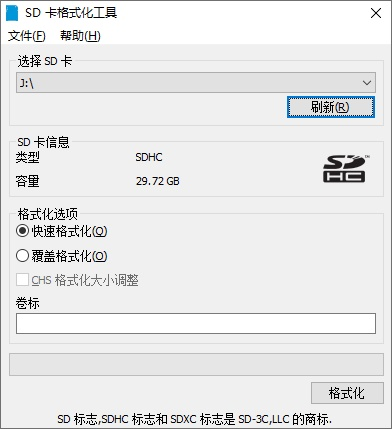

## 3.2 [下载OpenWrt系统镜像](https://github.com/SuLingGG/OpenWrt-Rpi/tags)

- 选择**运行平台**

- 选择**版本**：初始化的情况下，推荐下载**ext4-factory版本**或**squashfs-factory版本**。
  - **squashfs**：重置系统更方便
  - **ext4**：固件扩容更简单
  - **factory**：初始化系统时使用
  - **sysupgrade**：升级系统时使用

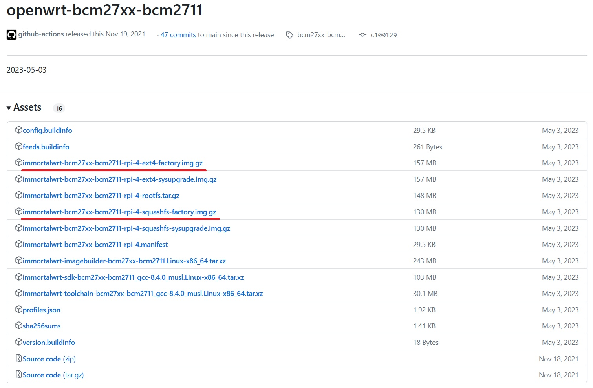

## 3.3 烧录系统

- 下载[Etcher](https://www.balena.io/etcher/)
- 将**TF卡**插入**读卡器**中，然后插入**上位机**中

- 运行**Etcher**
- 选择**系统镜像**

- 选择**设备**

- **刷机**

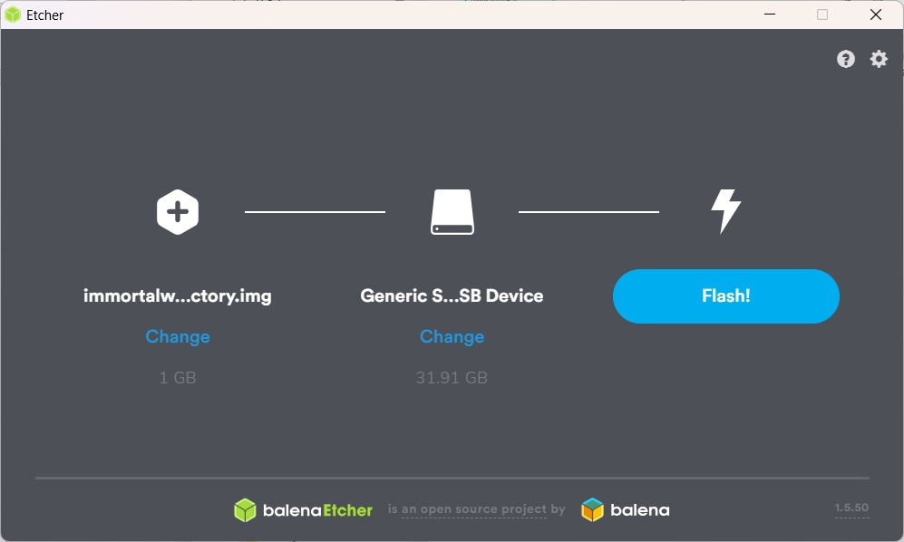

- **刷机完成**

# 4. 配置OpenWrt系统

## 4.1 树莓派启动

- 刷机完成后，**将TF卡弹出，插入树莓派中**

- 将**树莓派**通过**网线**与**上位机**连接

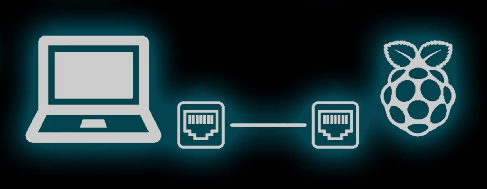

- 树莓派接入电源，**开机**

## 4.2 修改上位机的IP信息

​	由于**OpenWrt系统的默认IP地址**为**192.168.1.1**，因此要先把**上位机的IP地址**改到**和OpenWrt在同一网段下**，才能访问OpenWrt系统。

- 通过**控制面板**→**网络和共享中心**，选中需要修改的**网络**，选择**属性**，双击 **Internet协议版本4(TCP/IPv4)** 修改上位机的网络信息，下述信息供参考：

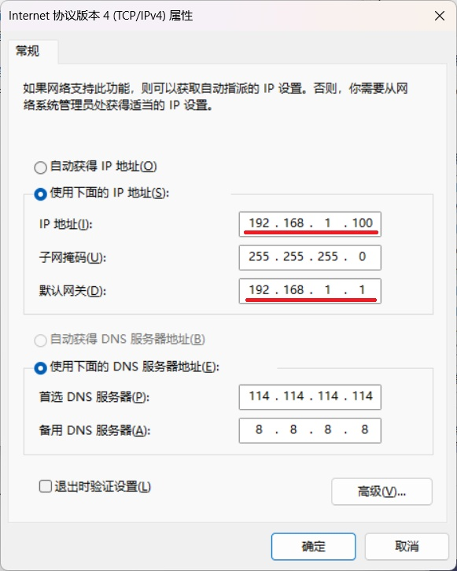

## 4.3 访问OpenWrt系统

​	完成上位机的网络修改后，打开浏览器，输入OpenWrt系统的 **默认IP地址（192.168.1.1）** 进行访问。

- **默认用户名：root**
- **默认密码：password**

## 4.4 【关键步骤】修改OpenWrt网络配置参数

- 选择左侧边栏的**网络→接口**项

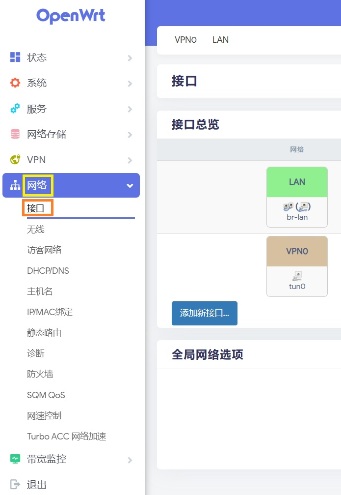

- 在**LAN**页面中，**固定IP地址**、**设定网关**、**设定DNS服务器**
  - 由于我的**上级路由器的IP地址**是**192.168.2.1**，因此**树莓派的网关**也同样设置为**192.168.2.1**
  - **树莓派的IP地址**设置为**192.168.2.x，x为2-254中的任一数值**，注意**不要与既有的IP地址冲突**
  - **DNS服务器**可以设定为：**114.114.114.114**（国内通用），**8.8.8.8**（谷歌服务器），**223.5.5.5**（阿里云服务器）

- **关闭DHCP功能**

## 4.5 修改防火墙配置

- 选择左侧边栏的**网络→防火墙**项

- 在**自定义规则**页面中，添加`iptables -t nat -I POSTROUTING -j MASQUERADE`，然后点击下方的**重启防火墙**即可

## 4.6 树莓派投入使用

- 完成上述设定后，**退出OpenWrt系统**

- **关闭树莓派**
- 将**树莓派**通过**网线**与**上级路由器**连接

- **重新启动树莓派**

## 4.7 测试

- 将**上位机的网络信息**改为**自动获得IP地址**，联网测试网络连接情况——测试**能否通过主路由进行联网**

- 修改**上位机的网络信息**，**IP地址**改为**与既有IP地址不冲突的IP地址**，**网关**改为**树莓派的IP地址**，联网测试网络连接情况——测试**能否通过旁路由进行联网**

## 4.8 【建议】关闭AP热点

- 选择左侧边栏的**网络→无线**项
  - 如果不需要使用，可以直接**停用**
  - 如果需要使用，点击**修改**，**设定AP热点的接入密码**，保证网络使用的安全

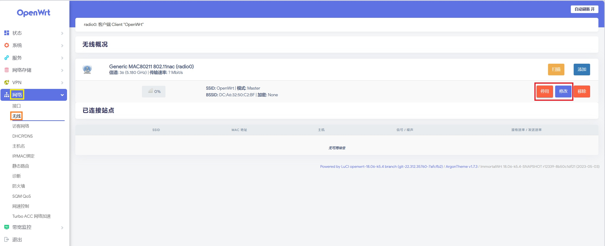

## 4.9 【建议】关闭LED灯

- 选择左侧边栏的**系统→LED配置**项
  - 默认状态为**未选中**，表示LED灯已关闭

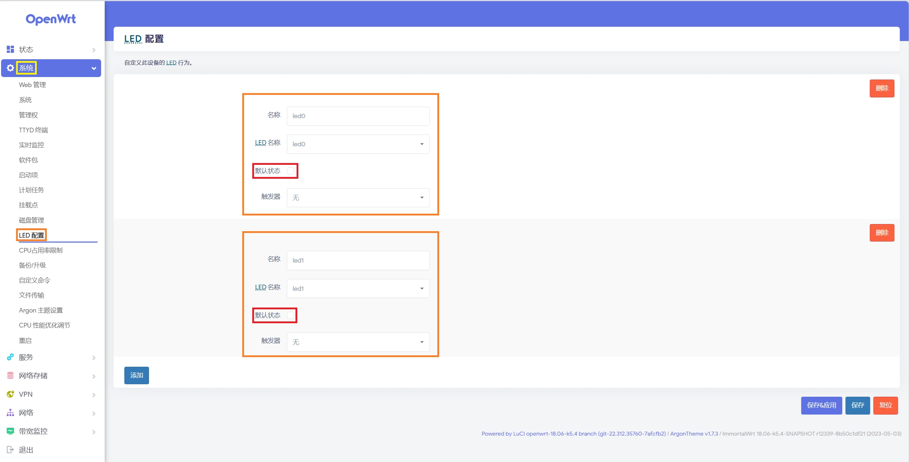

# 5. 配置clash插件

## 5.1 购买服务

​	登陆[GLaDOS](https://glados.rocks/console/shop)商店，购买**支持OpenWRT路由器**的版本。

## 5.2 【关键步骤】配置服务

### 5.2.1 进入OpenWrt系统后台

### 5.2.2 添加配置订阅

- 选择左侧边栏的**服务→OpenClash**项，选择**配置订阅**，点击下方的**添加**

- 填入**配置文件名**和**订阅地址**
  - **配置文件名**：自定义取名
  - **订阅地址**：GLaDOS服务购买完成后，从[OpenWrt路由器使用向导](https://glados.rocks/console/router)中复制配置文件地址

### 5.2.3 关闭UDP流量转发

- 选择左侧边栏的**服务→OpenClash**项，选择**插件设置**，选择**模式设置**，取消勾选**UDP流量转发**

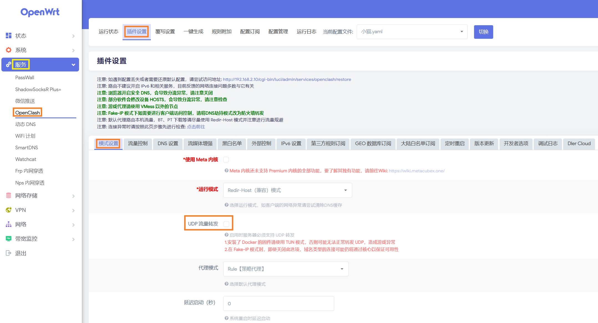

### 5.2.4 插件更新——升级内核版本

- 选择左侧边栏的**服务→OpenClash**项，选择**插件设置**，选择**版本更新**，点击下方的**一键检查更新**
  - 如果因为网络中断无法更新，可以自行从网络下载固件，**手动进行更新**

## 5.3 启动OpenClash

- 选择左侧边栏的**服务→OpenClash**项，选择**运行状态**

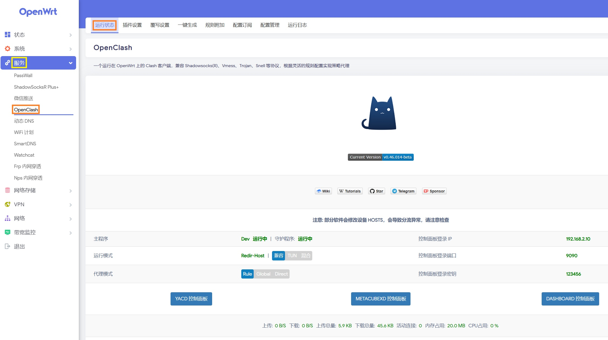

- 点击**启动OPENCLASH**，即可正常运行。

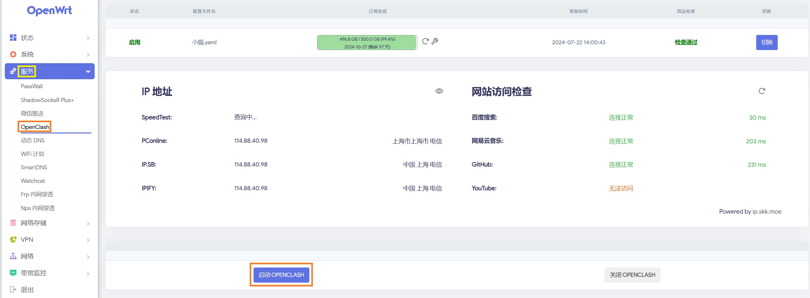

## 5.4 查看日志

​	启动clash过程中，如果启动失败，可在**运行日志**里查看失败原因。

- 选择左侧边栏的**服务→OpenClash**项，选择**运行日志**

